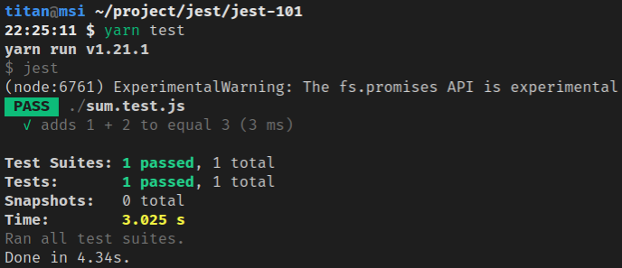
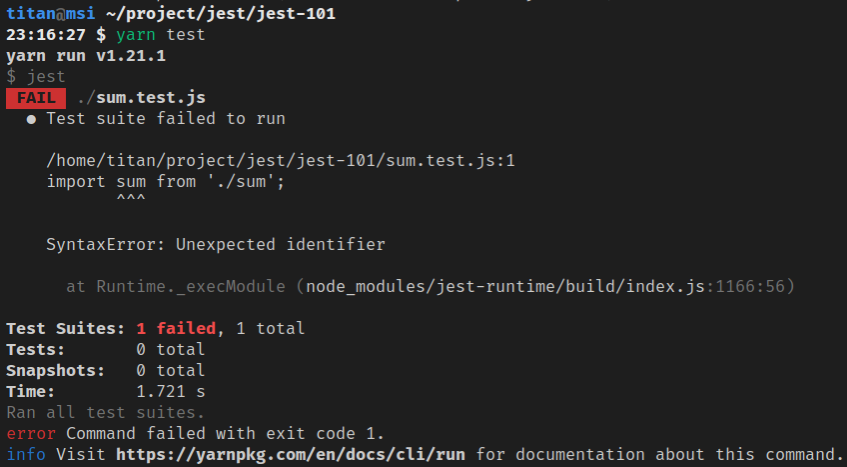
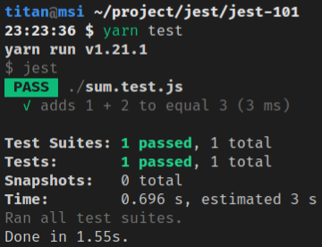

最近在學習單元測試，而 Jest 是在前端蠻常見的測試框架，可透過建立測試來確保自己寫的程式碼是否符合需求，而且當改動程式碼時，才能確保是否因不小心而產生的 bug，測試能讓我更有信心的去重構程式碼。

<!-- more -->

> 其他 Jest 相關文章可參閱 [Jest 系列文章](https://titangene.github.io/tags/jest/)。

那 Jest 可以用在哪些專案？你可為下面這些專案建立測試：
- [Babel](https://babeljs.io/)
- [TypeScript](https://www.typescriptlang.org/)
- [Node](https://nodejs.org/en/)
- [Angular](https://angular.io/)、[Vue](https://vuejs.org/)、[React](https://reactjs.org/)
- ...等

下面來介紹如何建置 Jest 的測試開發環境。

# 建立開發環境

## 建立 npm 專案

```shell
$ npm init -y
```

## 安裝 Jest

```shell
$ yarn add -D jest
```

或

```shell
$ npm install -D jest
```

## 設定 `package.json`

在 `package.json` 加上下面內容：

```json
{
  "scripts": {
    "test": "jest"
  }
}
```

# 寫範例程式碼

```javascript
// sum.js
function sum(a, b) {
  return a + b;
}
module.exports = sum;
```

```javascript
// main.js
const sum = require('./sum');

console.log(sum(1, 2));
```

執行 `main.js`：

```shell
$ node main.js
3
```

# 建立測試

```javascript
// sum.test.js
const sum = require('./sum');

test('adds 1 + 2 to equal 3', () => {
  // Arrange
  let x = 1, y = 2;
  let expected = 3;

  // Act
  let actual = sum(x, y);

  // Assert
  expect(actual).toBe(expected);
});
```

# 執行測試

```shell
$ yarn test
```

或

```shell
$ npm run test
```

測試通過：



# 從指令列執行測試

例如：Jest 只執行 match `my-test` 的測試檔案，以及使用 `config.json` 作為配置檔案，並且在執行後顯示 native 的 OS 通知：

```shell
$ jest my-test --notify --config=config.json
```

Jest CLI option 說明：
- `jest <regexForTestFiles>`：match 到名為 `<regexForTestFiles>` (像此範例的 `my-test` ) 的檔案執行 Jest
  - 若在執行 `jest` 時使用了 `<regexForTestFiles>` argument，該 argument 會被視為 regex pattern，Jest 只會執行與 pattern match 的測試檔案
  - 有些 terminal 可能需要用引號把 argument 包起來，例如：`jest "my.*(complex)?pattern"`
  - Windows 需使用 `/` 作為路徑分隔字元 (separator) 或將 `\` 轉義 (escape) 成 `\\`
- `--config=<path>`，`-c=<path>`：使用 `<path>` (像此範例的 `config.json` ) 作為配置檔案
  - Jest 配置檔案的路徑來指定如何查找和執行測試
  - 如果在配置中未設定 `rootDir`，則假定包含配置檔案的目錄為專案的 `rootDir`
  - 也可以是 JSON-encoded value 作為 Jest 的配置 
- `--notify`：執行完成後顯示原生的 OS 通知
  - 激活 (activates) 測試結果通知
  - 當你不希望自己的意識能夠專注於 JavaScript 測試以外的任何事物時，可用此 option
  - Beware：Jest 使用 [node-notifier](https://github.com/mikaelbr/node-notifier) 來顯示桌面通知
    - 在 Windows 上，它在第一次使用時會建立一個新的 start menu entry，並且不會顯示通知。通知將在後續執行中正確顯示

# Jest Config

使用下面指令生成 Jest 的基礎配置檔案 `jest.config.js`：

```shell
$ jest --init
```

因為我沒有在 global 安裝 `jest`，所以需要透過 `yarn` 來執行 Jest CLI (或是可透過 `npx` 來執行)：

```shell
$ yarn test --init
yarn run v1.21.1
$ jest --init

The following questions will help Jest to create a suitable configuration for your project

✔ Choose the test environment that will be used for testing › node
✔ Do you want Jest to add coverage reports? … yes
✔ Automatically clear mock calls and instances between every test? … no

📝  Configuration file created at /home/titan/.local/share/Trash/files/jest.config.js
Done in 7.41s.
```

第一個問題我選擇 `node`：

```shell
? Choose the test environment that will be used for testing › - Use arrow-keys. Return to submit.
❯   node
    jsdom (browser-like)
```

第二個問題：是否要測試涵蓋報告 (coverage reports)？我選擇 `yes`：

```shell
? Do you want Jest to add coverage reports? › (y/N)
```

第三個問題：是否要在每個測試之間自動清除 mock calls 和 instance？我選擇 `No`：

```shell
? Automatically clear mock calls and instances between every test? › (y/N)
```

下面是剛剛執行 `jest init` 時，所生成的 `jest.config.js` 設定：
- `coverageDirectory`：Jest 輸出的 coverage 檔案要放在哪個目錄
  - 預設：`undefined`
- `testEnvironment`：用於測試的測試環境
  - 預設：`"jsdom"` (類似瀏覽器的環境)
  - 若要建置 node service，可用 `"node"` 來使用類似 node 的環境

```javascript
module.exports = {
  coverageDirectory: "coverage",
  testEnvironment: "node"
};
```

> 更多 Jest 配置設定，詳情可參閱 [Configuring Jest · Jest](https://jestjs.io/docs/en/configuration)。

# 使用 Babel

在安裝 Babel 前，將程式碼改成 ES6 語法：

```javascript
// sum.js
const sum = (a, b) => a + b;
export default sum;
```

```javascript
// main.js
import sum from './sum';

console.log(sum(1, 2));
```

```javascript
// sum.test.js
import sum from './sum';

test('adds 1 + 2 to equal 3', () => {
  // Arrange
  let x = 1, y = 2;
  let expected = 3;

  // Act
  let actual = sum(x, y);

  // Assert
  expect(actual).toBe(expected);
});
```

跑測試會出錯，因為 Jest 需要透過 Babel 才能執行 ES6 的語法：

```shell
$ yarn test
```



所以來安裝 [Babel](http://babeljs.io/)：

```shell
$ yarn add -D babel-jest @babel/core @babel/preset-env
```

在專案根目錄建立 `babel.config.js`，此檔案用於配置與你當前 Node 版本相容的 Babel：

```javascript
// babel.config.js
module.exports = {
  presets: [
    [
      '@babel/preset-env',
      {
        targets: {
          node: 'current',
        },
      },
    ],
  ],
};
```

再跑測試就會通過：

```shell
$ yarn test
```



> 詳情可參閱 [Babel 官方文件](https://babeljs.io/docs/en/)。

資料來源：
- [Getting Started · Jest](https://jestjs.io/docs/en/getting-started)
- [Jest CLI Options · Jest](https://jestjs.io/docs/en/cli)
- [Configuring Jest · Jest](https://jestjs.io/docs/en/configuration)