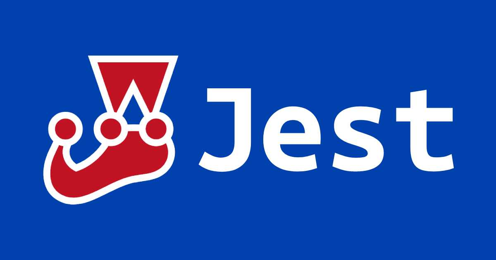

Assertion (斷言) 就要測試程式碼的執行結果是否符合預期，如果結果一致，代表測試通過，否則 assertion 就會拋出錯誤，代表測試失敗。而 Jest 提供多種 matcher，能讓你 assert 程式碼執行結果的正確性。

<!-- more -->

> 之前介紹了如何建制 Jest 測試環境，還沒安裝環境的可參閱：
> - [Jest：建置測試環境 (包含 Babel) | Titangene Blog](https://titangene.github.io/article/jest-build-test-env.html)
> - [Jest + TypeScript：建置測試環境 | Titangene Blog](https://titangene.github.io/article/jest-typescript.html)

> 其他 Jest 相關文章可參閱 [Jest 系列文章](https://titangene.github.io/tags/jest/)。

下面介紹 Jest 提供的各種 matcher：

# 通用 Matchers

`expect()` 回傳一個 "期望 (expectation)" 的物件

當 Jest 執行時，它會追蹤所有失敗的 matcher，以便列印錯誤訊息：
- `.toBe()` 是 matcher，使用 [`Object.is()`](https://developer.mozilla.org/en-US/docs/Web/JavaScript/Reference/Global_Objects/Object/is) 來測試 exact equality (精確相等)
- `.toEqual()`：檢查物件的值，遞迴的檢查物件或陣列的每個 field
- `.not`：matcher 的相反

```javascript
test('two plus two is four', () => {
  expect(2 + 2).toBe(4);
});

test('object assignment', () => {
  const data = {one: 1};
  data['two'] = 2;
  expect(data).toEqual({one: 1, two: 2});
});

test('adding positive numbers is not zero', () => {
  for (let a = 1; a < 10; a++) {
    for (let b = 1; b < 10; b++) {
      expect(a + b).not.toBe(0);
    }
  }
});
```

# Truthiness (真實性)

在測試中，有時需要區分 `undefined`、`null` 和 `false`，但有時你又不需要區分。Jest 包含一些 helper，便於確認想要的內容：
- `toBeNull` 只 match `null`
- `toBeUndefined` 只 match `undefined`
- `toBeDefined` 與 `toBeUndefined` 相反
- `toBeTruthy` match 任何 `if` 陳述句為 true
- `toBeFalsy` match 任何 `if` 陳述句為 false

```javascript
test('null', () => {
  const n = null;
  expect(n).toBeNull();
  expect(n).not.toBeUndefined();
  expect(n).toBeDefined();
  expect(n).not.toBeTruthy();
  expect(n).toBeFalsy();
});

test('zero', () => {
  const z = 0;
  expect(z).not.toBeNull();
  expect(z).toBeDefined();
  expect(z).not.toBeUndefined();
  expect(z).not.toBeTruthy();
  expect(z).toBeFalsy();
});
```

# Numbers

大多數的比較數字都有 matcher equivalents (等價物)：
- `toBeGreaterThan()`：比較 `received > expected`
- `toBeGreaterThanOrEqual()`：比較 `received >= expected`
- `toBeLessThan()`：比較 `received < expected`
- `toBeLessThanOrEqual()`：比較 `received <= expected`

```javascript
test('two plus two', () => {
  const value = 2 + 2;
  expect(value).toBeGreaterThan(3);
  expect(value).toBeGreaterThanOrEqual(3.5);
  expect(value).toBeLessThan(5);
  expect(value).toBeLessThanOrEqual(4.5);

  // toBe 和 toEqual 等價於數字
  expect(value).toBe(4);
  expect(value).toEqual(4);
});
```

對於浮點數相等，請使用 `toBeCloseTo()` 而不是 `toEqual()`，因為你不希望測試依賴於微小的捨入誤差 (rounding error)：

```javascript
test('adding floating point numbers', () => {
  const value = 0.1 + 0.2;
  // expect(value).toBe(0.3);        由於舍入錯誤無法運作
  expect(value).toBeCloseTo(0.3); // 可運作
});
```

# Strings

可用 `toMatch()` 根據 regex 檢查字串：

```javascript
test('there is no I in team', () => {
  expect('team').not.toMatch(/I/);
});

test('but there is a "stop" in Christoph', () => {
  expect('Christoph').toMatch(/stop/);
});
```

# Arrays 和 iterables

可用 `toContain()` 來檢查陣列或可迭代物件是否包含特定項目：

```javascript
const shoppingList = [
  'diapers',
  'kleenex',
  'trash bags',
  'paper towels',
  'beer',
];

test('the shopping list has beer on it', () => {
  expect(shoppingList).toContain('beer');
  expect(new Set(shoppingList)).toContain('beer');
});
```

# Exceptions

若要測試特定函數在呼叫時是否拋出錯誤，請使用 `toThrow()`：

```javascript
function compileAndroidCode() {
  throw new Error('you are using the wrong JDK');
}

test('compiling android goes as expected', () => {
  expect(compileAndroidCode).toThrow();
  expect(compileAndroidCode).toThrow(Error);

  // 還可以使用確切的錯誤訊息或 regexp
  expect(compileAndroidCode).toThrow('you are using the wrong JDK');
  expect(compileAndroidCode).toThrow(/JDK/);
});
```

> 更多 matcher 可參閱 Jest 社群維護的 [jest-community/jest-extended](https://github.com/jest-community/jest-extended)。

資料來源：[Using Matchers · Jest](https://jestjs.io/docs/en/using-matchers)