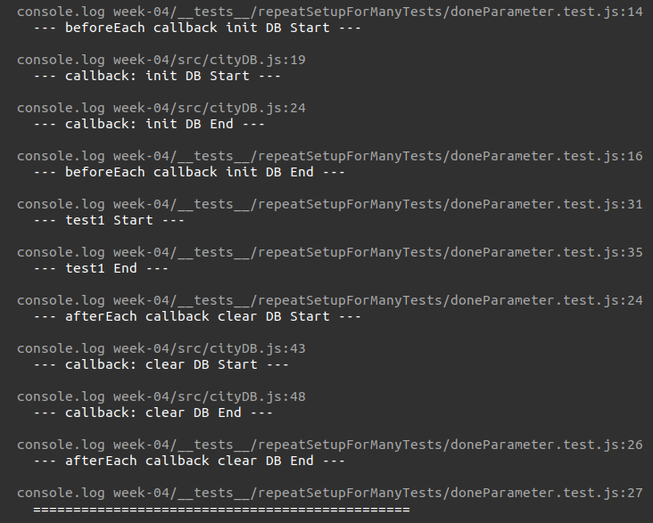
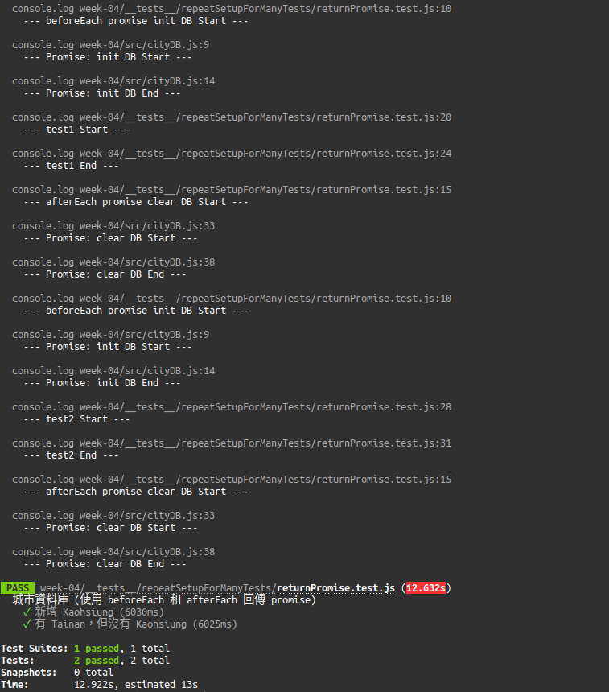

每個測試案例都必須是獨立的，不能互相影響，而解決方法就是讓每個測試在執行前進行重設，或在每個測試結束後清除痕跡。在 Jest，提供 setup 和 teardown 的函數，能讓你自訂在執行 `describe` 區塊或 `test` 區塊的前後分別要做什麼準備和收尾。

<!-- more -->

> 其他 Jest 相關文章可參閱 [Jest 系列文章](https://titangene.github.io/tags/jest/)。

# 測試案例互相汙染

一開始寫測試時，可能會發生測試案例互相汙染的問題。

例如：有一個城市資料庫，提供初始化、清除、新增以及檢查是否已存在資料庫內這些功能：

```javascript
// src/cityDB.js
let cityDB = [];

function initCityDB() {
  cityDB = ['Taipei', 'Tainan'];
}

function clearCityDB() {
  cityDB = [];
}

function addCity(city) {
  cityDB.push(city);
}

function isCity(city) {
  return cityDB.includes(city);
}

export {
  initCityDB,
  clearCityDB,
  addCity,
  isCity
}
```

如果測試寫起來像這樣會發現，第一個測試操作的步驟會影響到第二個測試 (所以第二個測試不用初始化 DB 和新增城市就已經擁有該城市，看起來很奇怪吧？)：

```javascript
// __tests__/unusedBeforeEachAndAfterEach.test.js
import {
  initCityDB,
  isCity,
  addCity
} from '../../src/cityDB';

describe('未使用 beforeEach 和 afterEach', () => {
  describe('測試案例會互相汙染', () => {
    test('新增 Kaohsiung', () => {
      initCityDB();
      expect(isCity('Kaohsiung')).toBeFalsy();
      addCity('Kaohsiung');
      expect(isCity('Kaohsiung')).toBeTruthy();
    });

    test('第二個測試案例未重新設定，所以有 Kaohsiung', () => {
      expect(isCity('Kaohsiung')).toBeTruthy();
    });
  });
});
```

所以你可能會手動處理初始化和清除的工作：

```javascript
// __tests__/unusedBeforeEachAndAfterEach.test.js
import {
  initCityDB,
  clearCityDB,
  isCity,
  addCity
} from '../../src/cityDB';

describe('未使用 beforeEach 和 afterEach', () => {
  describe('手動在每個測試案例重複設定', () => {
    test('新增 Kaohsiung', () => {
      initCityDB();
      expect(isCity('Kaohsiung')).toBeFalsy();
      addCity('Kaohsiung');
      expect(isCity('Kaohsiung')).toBeTruthy();
      clearCityDB();
    });
    
    test('第二個測試案例有重新設定，所以預設沒有 Kaohsiung', () => {
      initCityDB();
      expect(isCity('Kaohsiung')).toBeFalsy();
      clearCityDB();
    });
  });
});
```

但每次都要手動處理這些問題很麻煩，所以在寫測試時常需要：
- 在測試執行前進行一些設定工作
- 在測試執行後進行一些收尾工作

# 多次測試的重複設定：`beforeEach`、`afterEach`

每個測試案例都要進行一些設定，可用 `beforeEach` 和 `afterEach`：
- `beforeEach(fn, timeout)`：
  - 在執行此檔案中的每個測試之前執行 `fn` 函數
  - 若 `fn` 函數回傳 promise 或 generator，Jest 會在執行測試之前等待該 promise resolve
  - 若 `beforeEach` 放在 `describe` 區塊內，就只會在此區塊內的測試之前執行
  - 例如：重置每個測試要使用的全域狀態
- `afterEach(fn, timeout)`：
  - 在執行此檔案中的每個測試之後執行 `fn` 函數
  - 若 `fn` 函數回傳 promise 或 generator，Jest 會等待該 promise resolve 後才會繼續
  - 若 `afterEach` 放在 `describe` 區塊內，就只會在此區塊內的測試之後執行
  - 例如：清除每個測試建立的某些臨時狀態

:::info
`timeout` 是可選參數，可提供 timeout 來指定 `beforeEach` 或 `afterEach` 中止前要等待的時間，單位為豪秒，預設為 5 秒。
:::

## 同步的重複設定

例如：要在每個測試案例執行之前呼叫 `initCityDB()`，並在每個測試案例執行之後呼叫 `clearCityDB()`：

```javascript
// __tests__/repeatSetupForManyTests/sync.test.js
import {
  addCity,
  clearCityDB,
  initCityDB,
  isCity
} from '../../src/cityDB';

describe('使用 beforeEach 和 afterEach 對多個測試重複設定', () => {
  beforeEach(() => {
    console.log(`--- beforeEach init DB Start ---`);
    initCityDB();
    console.log(`--- beforeEach init DB End ---`);
  });

  afterEach(() => {
    console.log(`--- afterEach clear DB Start ---`);
    clearCityDB();
    console.log(`--- afterEach clear DB End ---`);
    console.log(`=========================================`);
  });

  test('新增 Kaohsiung', () => {
    console.log(`--- test1 Start ---`);
    expect(isCity('Kaohsiung')).toBeFalsy();
    addCity('Kaohsiung');
    expect(isCity('Kaohsiung')).toBeTruthy();
    console.log(`--- test1 End ---`);
  });
  
  test('有 Tainan，但沒有 Kaohsiung', () => {
    console.log(`--- test2 Start ---`);
    expect(isCity('Tainan')).toBeTruthy();
    expect(isCity('Kaohsiung')).toBeFalsy();
    console.log(`--- test2 End ---`);
  });
});
```

執行測試；

```shell
$ npx jest ./__tests__/repeatSetupForManyTests/sync.test.js --watch
```


## 非同步的重複設定

`beforeEach` 和 `afterEach` 可以若要[處理非同步](https://jestjs.io/docs/en/asynchronous)，有兩種處理方式：
- 使用 `.done` 參數
- 回傳 promise

### 使用 `.done` 參數

```javascript
// __tests__/repeatSetupForManyTests/doneParameter.test.js
import {
  addCity,
  clearCityDBCallback,
  initCityDBCallback,
  isCity
} from '../../src/cityDB';

describe('beforeEach 和 afterEach 使用 done 參數', () => {
  beforeEach(done => {
    function callback() {
      done();
    }
    
    console.log(`--- beforeEach callback init DB Start ---`);
    initCityDBCallback(callback);
    console.log(`--- beforeEach callback init DB End ---`);
  });

  afterEach(done => {
    function callback() {
      done();
    }
    
    console.log(`--- afterEach callback clear DB Start ---`);
    clearCityDBCallback(callback);
    console.log(`--- afterEach callback clear DB End ---`);
    console.log(`===============================================`);
  });

  test('新增 Kaohsiung', () => {
    console.log(`--- test1 Start ---`);
    expect(isCity('Kaohsiung')).toBeFalsy();
    addCity('Kaohsiung');
    expect(isCity('Kaohsiung')).toBeTruthy();
    console.log(`--- test1 End ---`);
  });
  
  test('有 Tainan，但沒有 Kaohsiung', () => {
    console.log(`--- test2 Start ---`);
    expect(isCity('Tainan')).toBeTruthy();
    expect(isCity('Kaohsiung')).toBeFalsy();
    console.log(`--- test2 End ---`);
  });
})
```

執行測試：

```shell
$ npx jest ./__tests__/repeatSetupForManyTests/doneParameter.test.js --watch
```




### 回傳 promise

```javascript
// __tests__/repeatSetupForManyTests/returnPromise.test.js
import {
  addCity,
  initCityDBPromise,
  clearCityDBPromise,
  isCity
} from '../../src/cityDB';

describe('城市資料庫 (使用 beforeEach 和 afterEach 回傳 promise)', () => {
  beforeEach(() => {
    console.log(`--- beforeEach promise init DB Start ---`);
    return initCityDBPromise();
  });
  
  afterEach(() => {
    console.log(`--- afterEach promise clear DB Start ---`);
    return clearCityDBPromise();
  });

  test('新增 Kaohsiung', () => {
    console.log(`--- test1 Start ---`);
    expect(isCity('Kaohsiung')).toBeFalsy();
    addCity('Kaohsiung');
    expect(isCity('Kaohsiung')).toBeTruthy();
    console.log(`--- test1 End ---`);
  });
  
  test('有 Tainan，但沒有 Kaohsiung', () => {
    console.log(`--- test2 Start ---`);
    expect(isCity('Tainan')).toBeTruthy();
    expect(isCity('Kaohsiung')).toBeFalsy();
    console.log(`--- test2 End ---`);
  });
});
```

執行測試：

```shell
$ npx jest ./__tests__/repeatSetupForManyTests/returnPromise.test.js --watch
```



# 一次性設定：`beforeAll`、`afterAll`

有時需要在檔案的開頭執行一次設定。當設定是非同步時，可能很麻煩，所以不能直接在檔案開頭處理。Jest 提供 `beforeAll` 和 `afterAll` 來處理這種情況。

若要在所有測試執行之後處理一些事，可用 `beforeAll` 和 `afterAll`：
- `beforeAll(fn, timeout)`：
  - 在執行此檔案中的所有測試之前執行 `fn` 函數
  - 若 `fn` 函數回傳 promise 或 generator，Jest 會在執行測試之前等待該 promise resolve
  - 若 `beforeAll` 放在 `describe` 區塊內，就只會在此區塊內的開頭執行
  - 例如：設定多個測試都要共用的全域狀態
- `afterAll(fn, timeout)`：
  - 在執行此檔案中的所有測試之後執行 `fn` 函數
  - 若 `fn` 函數回傳 promise 或 generator，Jest 會等待該 promise resolve 後才會繼續
  - 若 `afterAll` 放在 `describe` 區塊內，就只會在此區塊內的結尾執行
  - 例如：清除多個測試都要共用的全域狀態

:::info
`timeout` 是可選參數，可提供 timeout 來指定 `beforeAll` 或 `afterAll` 中止前要等待的時間，單位為豪秒，預設為 5 秒
:::

例如：若 `initCityDBPromise` 和 `clearCityDBPromise` 都回傳 promise，並且城市資料庫可以在多個測試案例之間重用：

```javascript
// src/cityDB.js
function initCityDBPromise() {
  return new Promise((resolve, reject) => {
    console.log(`--- Promise：init DB Start ---`);
    setTimeout(() => {
      cityDB = ['Taipei', 'Tainan'];
      resolve();
    }, 3000);
    console.log(`--- Promise：init DB End ---`);
  });
}

function clearCityDBPromise() {
  return new Promise((resolve, reject) => {
    console.log(`--- Promise：clear DB Start ---`);
    setTimeout(() => {
      cityDB = [];
      resolve();
    }, 3000);
    console.log(`--- Promise：clear DB End ---`);
  });
}
```

```javascript
// __tests__/setupAndTeardown.test.js
import {
  initCityDBPromise,
  clearCityDBPromise,
  isCity
} from '../src/cityDB';

beforeAll(() => {
  console.log('beforeAll');
  return initCityDBPromise();
});

afterAll(() => {
  console.log('afterAll');
  return clearCityDBPromise();
});

test('有 Tainan', () => {
  console.log('test 1');
  expect(isCity('Tainan')).toBeTruthy();
});

test('沒有 Kaohsiung', () => {
  console.log('test 2');
  expect(isCity('Kaohsiung')).toBeFalsy();
});
```

執行測試：

```shell
$ npx jest ./__tests__/setupAndTeardown.test.js --watch
```


# Scoping

`before` 和 `after` 區塊適用於檔案中的每個測試，也可放在 `describe` 區塊來將測試案例分組。當 `before` 和 `after` 放在 `describe` 區塊中時，只適用在該 `describe` 區塊中的測試案例。

若以下這些放在 `describe` 區塊內；
- `beforeAll`：只會在此區塊內的開頭執行
- `afterAll`：只會在此區塊內的結尾執行
- `beforeEach`：只會在此區塊內的測試之前執行
- `afterEach`：只會在此區塊內的測試之後執行

例如：有城市資料庫和食物資料庫，可為不同測試做不同設定：

```javascript
// src/foodDB.js
let foodDB = [];

function initFoodDBPromise() {
  return new Promise((resolve, reject) => {
    console.log(`--- Promise: init DB Start ---`);
    setTimeout(() => {
      foodDB = [
        { city: 'Taipei', name: 'Apple' },
        { city: 'Tainan', name: 'Banana' }
      ];
      resolve();
    }, 3000);
    console.log(`--- Promise: init DB End ---`);
  });
}

function clearFoodDBPromise() {
  return new Promise((resolve, reject) => {
    console.log(`--- Promise: clear DB Start ---`);
    setTimeout(() => {
      foodDB = [];
      resolve();
    }, 3000);
    console.log(`--- Promise: clear DB End ---`);
  });
}

function isValidCityFoodPair(foodCity, foodName) {
  return foodDB.some(food => (food.city === foodCity) && (food.name === foodName));
}

export {
  initFoodDBPromise,
  clearFoodDBPromise,
  isValidCityFoodPair
}
```

```javascript
// __tests__/scoping/scope.test.js
import {
  initCityDBPromise,
  clearCityDBPromise,
  isCity
} from '../../src/cityDB';

import {
  initFoodDBPromise,
  clearFoodDBPromise,
  isValidCityFoodPair
} from '../../src/foodDB';

// 適用於此文件中的所有測試
beforeEach(() => {
  console.log('global: beforeEach');
  return initCityDBPromise();
});

afterEach(() => {
  console.log('global: afterEach');
  return clearCityDBPromise();
});

test('城市資料庫有 Tainan', () => {
  console.log('global: test1');
  expect(isCity('Tainan')).toBeTruthy();
});

test('城市資料庫沒有 Kaohsiung', () => {
  console.log('global: test2');
  expect(isCity('Kaohsiung')).toBeFalsy();
});

describe('城市與食物 match', () => {
  // 僅適用於此 describe 區塊中的測試
  beforeEach(() => {
    console.log('scope: beforeEach');
    return initFoodDBPromise();
  });
  
  afterEach(() => {
    console.log('scope: afterEach');
    return clearFoodDBPromise();
  });
  
  test('Taipei <3 Apple', () => {
    console.log('scope: test1');
    expect(isValidCityFoodPair('Taipei', 'Apple')).toBe(true);
  });
  
  test('Tainan <3 Banana', () => {
    console.log('scope: test2');
    expect(isValidCityFoodPair('Tainan', 'Banana')).toBe(true);
  });
});
```

執行測試：

```shell
$ npx jest ./__tests__/scoping/scope.test.js --watch
```


測試檔最上層的 `beforeEach` 會在 `describe` 區塊內的 `beforeEach` 之前執行。看以下範例可了解這些 hook 的執行順序：

```javascript
// __tests__/scoping/executionOrder.test.js
beforeAll(() => console.log('global: beforeAll'));
afterAll(() => console.log('global: afterAll'));

beforeEach(() => console.log('global: beforeEach'));
afterEach(() => console.log('global: afterEach'));

test('', () => console.log('global: test'));

describe('Scoped / Nested block', () => {
  beforeAll(() => console.log('scope: beforeAll'));
  afterAll(() => console.log('scope: afterAll'));

  beforeEach(() => console.log('scope: beforeEach'));
  afterEach(() => console.log('scope: afterEach'));

  test('', () => console.log('scope: test'));
});

// global: beforeAll
// global: beforeEach
// global: test
// global: afterEach

// scope: beforeAll
// global: beforeEach
// scope: beforeEach
// scope: test
// scope: afterEach
// global: afterEach
// scope: afterAll

// global: afterAll
```

執行測試：

```shell
$ npx jest ./__tests__/scoping/executionOrder.test.js --watch
```


# `describe` 區塊和 `test` 區塊的執行順序

- Jest 在執行任何測試之前，會先執行測試檔案中的所有 `describe` handler
  - 這就是為何要在 `before*` 和 `after*` handler 中進行設定和拆除 (setup and teardown)，而不是在 `describe` 區塊中處理的原因
- 當 `describe` 區塊完成時，預設情況下，Jest 會按照在收集階段中遇到的順序連續執行所有測試，等待每個測試完成並進行整理之後再繼續

```javascript
// __tests__/orderOfExecutionOfDescribeAndTestBlocks.test.js
describe('outer', () => {
  console.log('describe outer-a');

  describe('describe inner 1', () => {
    console.log('describe inner 1');
    test('test 1', () => {
      console.log('test for describe inner 1');
      expect(true).toEqual(true);
    });
  });

  console.log('describe outer-b');

  test('test 1', () => {
    console.log('test for describe outer');
    expect(true).toEqual(true);
  });

  describe('describe inner 2', () => {
    console.log('describe inner 2');
    test('test for describe inner 2', () => {
      console.log('test for describe inner 2');
      expect(false).toEqual(false);
    });
  });

  console.log('describe outer-c');
});

// describe outer-a
// describe inner 1
// describe outer-b
// describe inner 2
// describe outer-c
// test for describe inner 1
// test for describe outer
// test for describe inner 2
```

執行測試：

```shell
$ npx jest ./__tests__/scoping/OrderOfExecutionOfDescribeAndTestBlocks.test.js --watch
```


# 建議

如果測試失敗，要檢查的第一件事就是當只有它在執行時是否會失敗。若只要讓 Jest 執行一個測試，可將測試指令臨時改成 [`test.only`](https://titangene.github.io/article/jest-describe-test-case.html#test-only-name-fn-timeout)：

```javascript
// __tests__/testOnly.test.js
test.only('this will be the only test that runs', () => {
  expect(true).toBe(true);
});

test('this test will not run', () => {
  expect('A').toBe('A');
});
```

執行測試：

```shell
$ npx jest ./__tests__/testOnly.test.js --watch
```


如果你有一個測試在大型案例的一部份執行會發生錯誤，但單獨執行不會失敗，那可能是其他測試干擾了此測試。通常可用 `beforeEach` 來清除一些共享狀態來解決此問題。若不確定是否正在修改哪些共享狀態，也可嘗試用 `beforeEach` 來紀錄資料。

# 參考資料

- [Setup and Teardown · Jest](https://jestjs.io/docs/en/setup-teardown)
- [Jest | 測試設定分類 (describe) 及作用域 (scoping) by 神Q超人](https://medium.com/enjoy-life-enjoy-coding/unit-test-替測試設置分類-describe-及作用域-scoping-2c5082266ca)