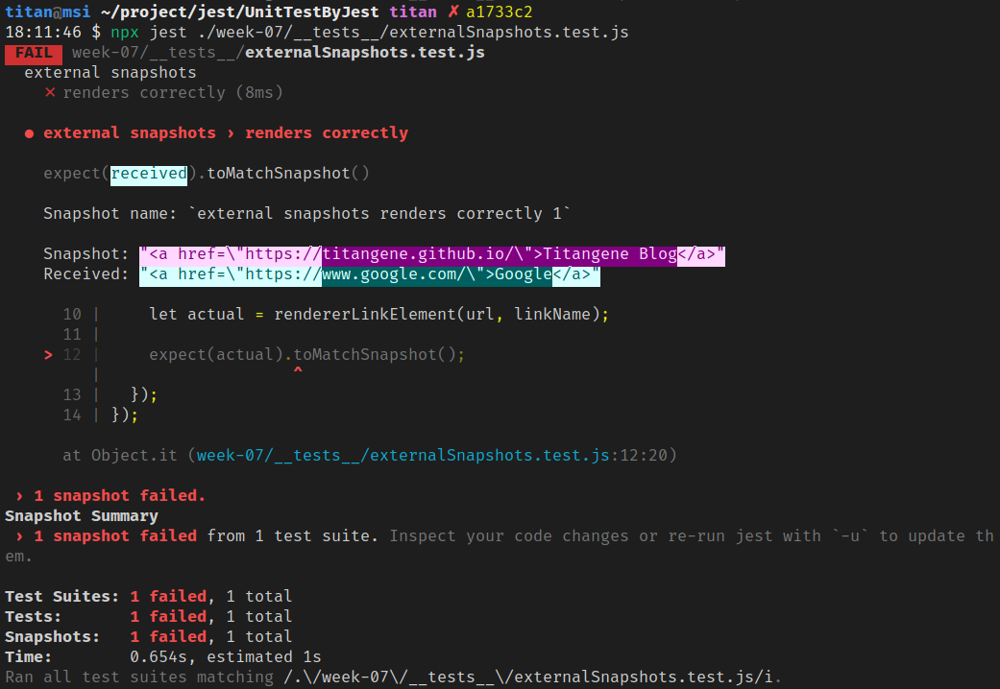
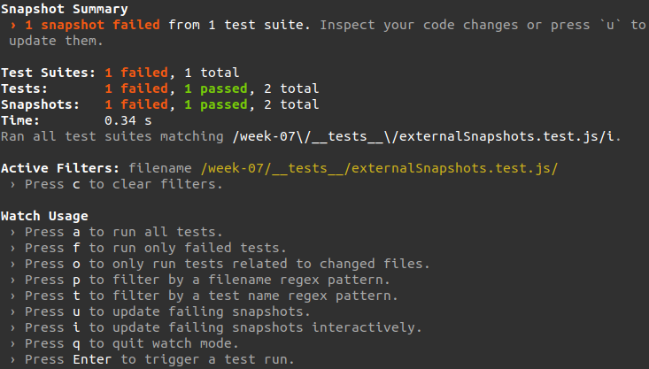
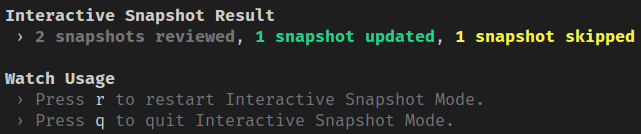
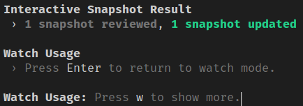
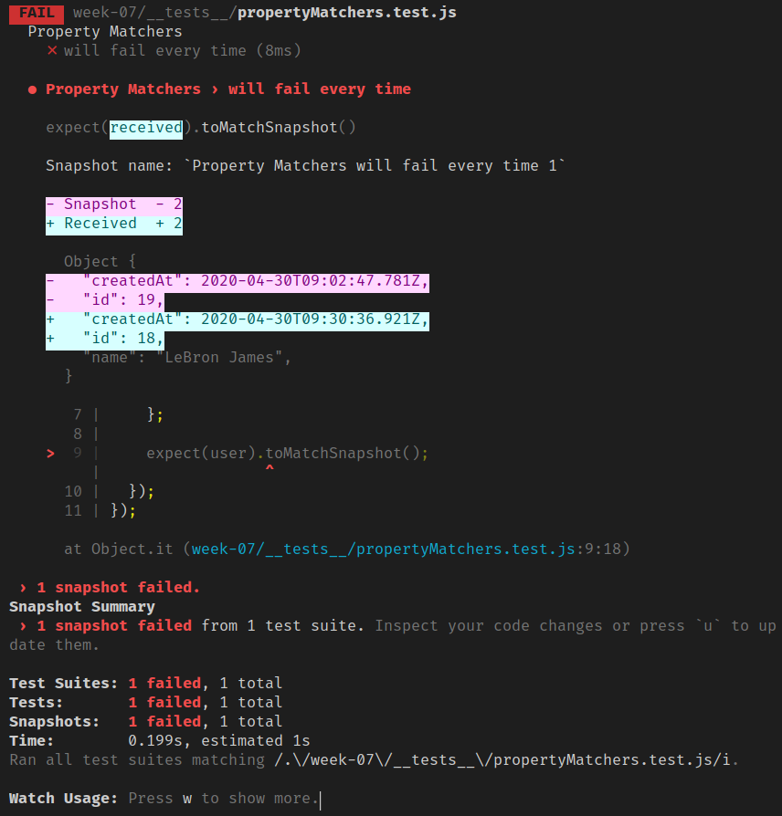

若想確保 UI 不會因意外修改而產生 bug，snapshot 測試就是一個很好用的工具。

<!-- more -->

> 其他 Jest 相關文章可參閱 [Jest 系列文章](https://titangene.github.io/tags/jest/)。

# 使用 Jest 進行 snapshot 測試

如果想測試一個 UI 元件，要測的是產生的元素 (可序列化的值，即 HTML 原始碼)，而不是需要花時間渲染出來的畫面 (圖形 UI)。

下面以連結元件為例，呼叫 `rendererLinkElement()`，並傳入 URL 和連結名稱就可以取得 renderer 回傳的 HTML：

```javascript
// src/linkElement.js
function rendererLinkElement(url, linkName) {
  return `<a href="${url}">${linkName}</a>`;
}

export default rendererLinkElement;
```

這邊使用 Jest 提供的 `toMatchSnapshot()` 進行測試：

```javascript
// __tests__/externalSnapshots.test.js
describe('external snapshots', () => {
  it('render the link element of the Titangene Blog home page', () => {
    const url = 'https://titangene.github.io/';
    const linkName = 'Titangene Blog';

    const actual = rendererLinkElement(url, linkName);

    expect(actual).toMatchSnapshot();
  });
});
```

執行測試：

```shell
$ npx jest ./__tests__/externalSnapshots.test.js
 PASS  __tests__/externalSnapshots.test.js
  external snapshots
    ✓ render the link element of the Titangene Blog home page (3ms)

 › 1 snapshot written.
Snapshot Summary
 › 1 snapshot written from 1 test suite.

Test Suites: 1 passed, 1 total
Tests:       1 passed, 1 total
Snapshots:   1 written, 1 total
Time:        0.657s, estimated 1s
Ran all test suites matching /.\/__tests__\/externalSnapshots.test.js/i.
```

第一次執行此測試時，Jest 會在 `__tests__` 目錄內建立 `__snapshots__` 目錄，裡面建立一個 snapshot 檔案，檔名會是測試檔的名稱再加上 `.snap` (例如：`externalSnapshots.test.js.snap` )，內容如下：

```javascript
// Jest Snapshot v1, https://goo.gl/fbAQLP

exports[`renders correctly 1`] = `"<a href=\\"https://titangene.github.io/\\">Titangene Blog</a>"`;
```

之後再次執行測試就會將 render 的輸出與之前的 snapshot 進行比較：
- 若 match，測試就會通過
- 若不 match，測試就會失敗
  - 可能是程式有 bug，或是實作發生變化，需要更新 snapshot

```shell
$ npx jest ./__tests__/linkElement.test.js
 PASS  __tests__/linkElement.test.js
  ✓ renders correctly (4ms)

Test Suites: 1 passed, 1 total
Tests:       1 passed, 1 total
Snapshots:   1 passed, 1 total
Time:        0.777s, estimated 2s
Ran all test suites matching /.\/__tests__\/linkElement.test.js/i.
```

:::info
snapshot 應與修改的程式碼一起 commit，並在 code review 中進行 review。

註：Jest 內建提供 [`pretty-format`](https://github.com/facebook/jest/tree/master/packages/pretty-format) 套件，可讓任何 JavaScript 值變成 human-readable 的字串 (序列化 JavaScript 內建型別值)，而 snapshot 就使用了此套件，所以 snapshot 才能在 code review 過程具有可讀性。
:::

# 更新 snapshot

剛剛提到，若程式的實作發生變化，snapshot 與程式執行結果可能會不 match，測試就會失敗。

假設不是因為 bug，是你現在修改的執行結果的確是你要的，但 snapshot 還是之前的預期結果，而你想將 snapshot 換成新的預期結果，這就需要更新 snapshot。

下面就舉個情境，假設我想將測試修改成這樣：

```diff
it('renders correctly', () => {
-  const url = 'https://titangene.github.io/';
-  const linkName = 'Titangene Blog';
+  const url = 'https://www.google.com/';
+  const linkName = 'Google';

  const actual = rendererLinkElement(url, linkName);

  expect(actual).toMatchSnapshot();
});
```

再次執行測試就會失敗，因為之前 snapshot 儲存的跟現在修改的不 match：



使用 `--updateSnapshot` (或 `-u` ) option 就能為失敗的測試重新建立新的 snapshot (通過的測試不會重新建立)：

```shell
$ jest --updateSnapshot
```

```shell
$ npx jest ./__tests__/linkElement.test.js -u
 PASS  __tests__/linkElement.test.js
  ✓ renders correctly (4ms)

 › 1 snapshot updated.
Snapshot Summary
 › 1 snapshot updated from 1 test suite.

Test Suites: 1 passed, 1 total
Tests:       1 passed, 1 total
Snapshots:   1 updated, 1 total
Time:        0.794s, estimated 1s
Ran all test suites matching /.\/__tests__\/linkElement.test.js/i.
```

若要指定哪個測試需要重新產生 snapshot，可加上 `--testNamePattern=<regex>` option：

```javascript
$ jest -u --testNamePattern=<regex>
```

# 互動式 snapshot 模式

在 watch 模式下，按 `i` 鍵進入互動式 snapshot 模式 (只有在有 failed snapshot 時，才會看到 `i` 這個選項)：



此互動式 snapshot 模式是用 failed snapshot 和 failed output，此模式會各別看每個 snapshot，有以下功能：
- `u` (update)：更新失敗的 snapshot
- `s` (skip)：跳過當前測試 (跳至下一個測試)
- `q` (quit)：離開互動式 snapshot 模式
- `Enter`：觸發測試執行 (重跑單前測試)

只要還有一個 failed snapshot 未更新，就能按 `r` 鍵重新回到互動式 snapshot 模式：



更新所有 failed snapshot 後，就可按 `Enter` 回到 watch 模式：



> 可是奇怪的是，原本我執行 Jest 時有指定某個目錄內的測試，當我從互動式 snapshot 模式回到 watch 模式時，竟然之前的指令就失效，所以還會多測其他目錄內的測試 (目前猜測是未被 Git 追蹤的測試檔都會被執行)。

# Inline Snapshots

inline snapshot 和 external snapshot ( `.snap` 檔案) 的行為相同，但 inline snapshot 會把 snapshot value 自動寫回原始碼中。不用切換至外部檔案來確保寫入正確的值。

:::warning
inline snapshot 是由 [Prettier](https://prettier.io/) 提供支援，所以必須安裝 Prettier 才能用 inline snapshot。寫測試檔時，請遵守你的 Prettier 配置。

若你在 Jest 找不到的地方安裝 Prettier，則可用 [`prettierPath`](https://jestjs.io/docs/en/configuration#prettierpath-string) 配置屬性來告訴 Jest。

如果未安裝 Prettier 就使用 `toMatchInlineSnapshot()`，會輸出以下錯誤訊息：

```shell
 FAIL  __tests__/inlineSnapshots.test.js
  ● Test suite failed to run

    Cannot find module 'prettier' from 'setup_jest_globals.js'

      at Resolver.resolveModule (node_modules/jest-resolve/build/index.js:296:11)
```
:::

安裝 Prettier：

```shell
$ yarn add prettier --dev --exact
```

一開始寫測試時，不帶 argument 呼叫 `toMatchInlineSnapshot()`：

```javascript
// __tests__/inlineSnapshots.test.js
import rendererLinkElement from "../src/linkElement";

describe("inline snapshots", () => {
  it("render the link element of the Titangene Blog home page", () => {
    const url = "https://titangene.github.io/";
    const linkName = "Titangene Blog";

    const actual = rendererLinkElement(url, linkName);

    expect(actual).toMatchInlineSnapshot();
  });
});
```

執行測試時，Jest 會對 `tree` 進行評估，且 snapshot 會寫入 `toMatchInlineSnapshot()` 的 argument：

```shell
$ npx jest .__tests__/inlineSnapshots.test.js
 PASS  __tests__/inlineSnapshots.test.js
  inline snapshots
    ✓ render the link element of the Titangene Blog home page (12ms)

 › 1 snapshot written.
Snapshot Summary
 › 1 snapshot written from 1 test suite.

Test Suites: 1 passed, 1 total
Tests:       1 passed, 1 total
Snapshots:   1 written, 1 total
Time:        0.909s, estimated 1s
Ran all test suites matching /.\/__tests__\/inlineSnapshots.test.js/i.
```

```javascript
describe("inline snapshots", () => {
  it("render the link element of the Titangene Blog home page", () => {
    const url = "https://titangene.github.io/";
    const linkName = "Titangene Blog";

    const actual = rendererLinkElement(url, linkName);

    expect(actual).toMatchInlineSnapshot(
      `"<a href=\\"https://titangene.github.io/\\">Titangene Blog</a>"`
    );
  });
});
```

也可在指令使用 `--updateSnapshot` (或 `-u` ) option 或在 `--watch` 模式下按 `u` 鍵來更新 snapshot。

# Property Matchers

有時 snapshot 的物件中會有生成一些 field (例如：ID 和 Date)，若對這些物件進行 snapshot，就會在執行時常常發生 snapshot 失敗。

```javascript
// __tests__/propertyMatchers.test.js
describe('Property Matchers', () => {
  it('will fail every time', () => {
    const user = {
      name: 'Titan',
      createdAt: new Date(),
      id: Math.floor(Math.random() * 20)
    };

    console.log(user);

    expect(user).toMatchSnapshot();
  });
});
```

像上面的測試執行第二次時，snapshot 就會失敗：



所以 Jest 允許你對任何 property 提供 asymmetric matcher。Jest 會在寫入 snapshot 或測試 snapshot 之前，檢查 matcher，然後將 snapshot 儲存至 snapshot 檔案中，而不是 received value：

```javascript
// __tests__/propertyMatchers.test.js
describe('Property Matchers', () => {
  it('will check the matchers and pass', () => {
    const user = {
      name: 'Titan',
      createdAt: new Date(),
      id: Math.floor(Math.random() * 20)
    };

    console.log(user);

    expect(user).toMatchSnapshot({
      createdAt: expect.any(Date),
      id: expect.any(Number),
    });
  });
});
```

:::info
asymmetric matcher：在 [Jasmine](https://jasmine.github.io/tutorials/custom_argument_matchers) 也稱為 argument matcher，可用於建立自己的自訂 matcher 來封裝測試邏輯。
:::

下面是 snapshot 儲存的內容：

```javascript
// __tests__/__snapshots__/propertyMatchers.test.js.snap
exports[`Property Matchers will check the matchers and pass 1`] = `
Object {
  "createdAt": Any<Date>,
  "id": Any<Number>,
  "name": "Titan",
}
`;
```

任何非 matcher 的 givin value，會被被明確地檢查並儲存至 snapshot，例如下面測試中的 `name` property：

```javascript
// __tests__/propertyMatchers.test.js
describe('Property Matchers', () => {
  it('will check the values and pass', () => {
    const user = {
      name: 'Titan',
      createdAt: new Date(),
      id: Math.floor(Math.random() * 20)
    };

    console.log(user);

    expect(user).toMatchSnapshot({
      name: 'Titan',
      createdAt: expect.any(Date),
      id: expect.any(Number),
    });
  });
});
```

下面是 snapshot 儲存的內容：

```javascript
// __tests__/__snapshots__/propertyMatchers.test.js.snap
exports[`Property Matchers will check the values and pass 1`] = `
Object {
  "createdAt": Any<Date>,
  "id": Any<Number>,
  "name": "Titan",
}
`;
```

資料來源：
- [Snapshot Testing · Jest](https://jestjs.io/docs/en/snapshot-testing)
- [Jest 14.0: React Tree Snapshot Testing · Jest](https://jestjs.io/blog/2016/07/27/jest-14.html)
- [Testing with Jest Snapshots: First Impressions | benmccormick.org](https://benmccormick.org/2016/09/19/testing-with-jest-snapshots-first-impressions/)
- [Use Jest's Snapshot Testing Feature from @kentcdodds on @eggheadio](https://egghead.io/lessons/javascript-use-jest-s-snapshot-testing-feature?pl=testing-javascript-with-jest-a36c4074)