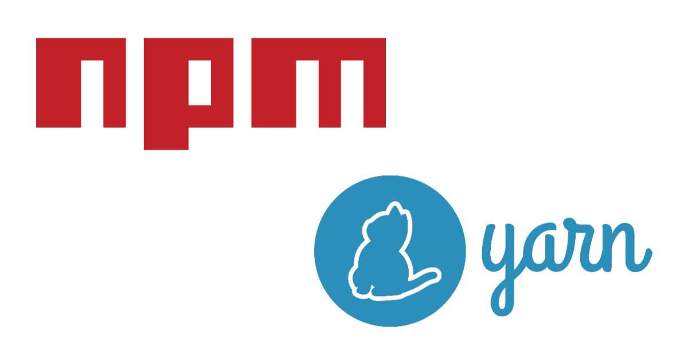

npm 或 Yarn 都是最常見的 Node.js 套件管理器。本篇紀錄兩個 CLI 對應的指令。

<!-- more -->

## 建立新專案

```shell
$ npm init
$ npm init -y
```

```shell
$ yarn init
$ yarn init -y
```

## 安裝專案 `package.json` 中的所有相依套件

```shell
$ yarn
$ yarn install
```

```shell
$ npm install
$ npm i
```

## 安裝相依套件

安裝相依套件，並將套件新增至不同類型的 `dependencies`：

```shell
$ npm i <package>
$ npm install <package>
```

```shell
$ yarn add <package>
$ yarn add <package>@<version>
$ yarn add <package>@<tag>
```

安裝套件並將此套件儲存至 `package.json` 中的 `dependencies` (目前 npm 的預設參數，不需加 `-S` 就有此功能，舊版 npm 需要加此 option 才會將安裝的套件存至 `package.json` )：

```shell
$ npm install <package> --save
$ npm install <package> -S
```

### 新增至不同類型的 dependencies

安裝相依套件，並將套件新增至不同類型的 `devDependencies`：

```shell
$ npm install <package> --save-dev
$ npm install <package> -D
```

```shell
$ yarn add <package> --dev
$ yarn add <package> -D
```

安裝相依套件，並將套件新增至不同類型的 `optionalDependencies`：

```shell
$ npm install <package> --save-optional
$ npm install <package> -O
```

```shell
$ yarn add <package> --optional
$ yarn add <package> -O
```

安裝相依套件，並將套件新增至不同類型的 `bundleDependencies`：

```shell
$ npm install <package> --save-bundle
$ npm install <package> -B
```

安裝相依套件，並將套件新增至不同類型的 `peerDependencies`：

```shell
$ yarn add <package> --peer
$ yarn add <package> -P
```

> 不同類型的 dependencies 可參閱 [Yarn 官方文件中的「依賴關係的種類」](https://classic.yarnpkg.com/zh-Hant/docs/dependency-types/) 這篇。

### 安裝指定版本

```shell
$ npm install <package> --save-exact
$ npm install <package> -E
```

```shell
$ yarn add <package> --exact
$ yarn add <package> -E
```

### 安裝次版號的最新版

```shell
$ yarn add <package> --tilde
$ yarn add <package> -T
```

### 在全域安裝套件

```shell
$ npm install -g <package>
```

```shell
$ yarn global add <package>
```

## 升級相依套件

升級目前專案的相依套件：

```shell
$ npm update
$ npm update <package>
```

```shell
$ yarn upgrade
$ yarn upgrade <package>
```

全域的相依套件：

```shell
$ npm update -g
$ npm update -g <package>
```

```shell
$ yarn global upgrade
$ yarn global upgrade <package>
```

### 升級至最新版

```shell
$ yarn upgrade <package> --latest
```

## 升級相依套件可選擇是否升級

```shell
$ yarn upgrade-interactive <package>
```

## 刪除套件

刪除目前專案的相依套件：

```shell
$ npm uninstall <package>
```

```shell
$ yarn remove <package>
```

刪除全域的相依套件：

```shell
$ npm uninstall -g <package>
```

```shell
$ yarn global remove <package>
```

## 列出已安裝的套件

```shell
$ npm ls
```

```shell
$ yarn list
```

資料來源
- [migrating from npm | Yarn](https://classic.yarnpkg.com/zh-Hant/docs/migrating-from-npm)
- [yarn add | Yarn](https://classic.yarnpkg.com/zh-Hant/docs/cli/add)