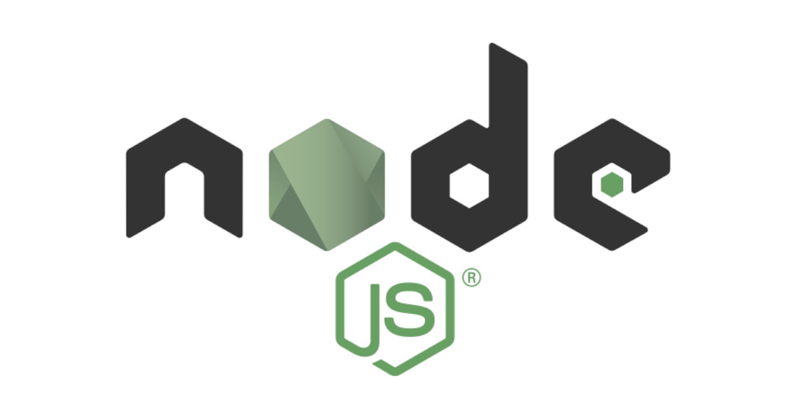
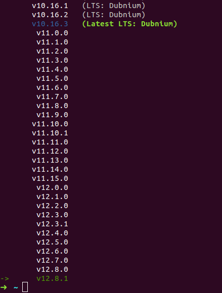
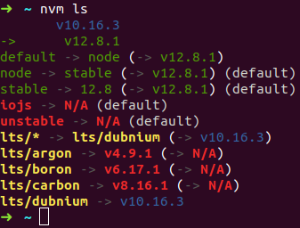

nvm 是 Node.js 的版本管理器 (version manager)，可在同一台主機上安裝多個版本的 Node.js 環境，因為不同專案可能會使用不同的 Node.js 版本，那就需要透過一個版本管理器來切換不同的 Node.js 版本。

<!-- more -->

## 安裝 NVM

可用 `cURL` 或 `wget` 指令使用安裝腳本安裝或更新 nvm：

```shell
$ curl -o- https://raw.githubusercontent.com/nvm-sh/nvm/v0.34.0/install.sh | bash
```

或

```shell
$ wget -qO- https://raw.githubusercontent.com/nvm-sh/nvm/v0.34.0/install.sh | bash
```

此安裝腳本會將 nvm repo clone 到 `~/.nvm`，並且將 source line 新增至你的 profile 設定 ( `~/.bash_profile`、`~/.zshrc`、`~/.profile` 或 `~/.bashrc` )：

```bash
export NVM_DIR="$HOME/.nvm"
[ -s "$NVM_DIR/nvm.sh" ] && \. "$NVM_DIR/nvm.sh"  # This loads nvm
[ -s "$NVM_DIR/bash_completion" ] && \. "$NVM_DIR/bash_completion"  # This loads nvm bash_completion
```

如果在 Linux 執行安裝腳本後，執行下面指令會顯示以下訊息或沒有任何訊息時，建議重開一個新的終端機 (terminal) 再重新執行一次 `nvm` 指令：

```shell
$ command -v nvm
nvm: command not found
```

如果還是無法使用 nvm，可執行下面指令立即應用 ZSH 的設定：

```shell
$ source .zshrc
```

:::warning
注意：
- 使用 `nvm` 時，不需要 `sudo` 即可使用 `npm -g` 全域安裝模組，所以與其執行 `sudo npm i -g`，不如執行 `npm i -g`
- 若你有 `~/.npmrc`，請確保裡面不包含任何 `prefix` 的設定 (因為與 `nvm` 不相容)
- 你可以 (但不應該) 保留以前在 "系統" 安裝的 Node.js，但 `nvm` 只對你的使用者帳戶 (用於安裝 `nvm` 的使用者帳戶) 可用。可能會導致版本不 match，因為其他使用者會使用 `/usr/local/lib/node_modules/*`，而使用者帳戶會使用 `~/.nvm/versions/node/vX.X.X/lib/node_modules/*`
:::

## `--version`：確認 NVM 是否安裝成功

```shell
$ nvm --version
0.34.0
```

## `install`：利用 NVM 安裝 Node.js

安裝 NVM 後，其實還沒安裝 Node 環境：

```shell
$ node  
zsh: command not found: node
```

如果執行下面指令，會提醒你需要執行 `install` 指令才能安裝 Node.js：

```shell
$ nvm use node
N/A: version "node -> N/A" is not yet installed.

You need to run "nvm install node" to install it before using it.
```

安裝最新版的 Node.js：

```shell
$ nvm install node
Downloading and installing node v12.8.1...
Downloading https://nodejs.org/dist/v12.8.1/node-v12.8.1-linux-x64.tar.xz...
#################################################################################################### 100.0%
Computing checksum with sha256sum
Checksums matched!
Now using node v12.8.1 (npm v6.10.2)
Creating default alias: default -> node (-> v12.8.1)
```

如果要指定安裝版本，可以直接指定版本號：

```shell
$ nvm install 8.9.1
```

安裝的第一個版本的 Node.js 會成員 nvm 的預設版本，新的 shell 就會以預設版本的 Node.js 來使用 (例如：`nvm alias default`)。

查看目前安裝 Node.js 的版本：

```shell
$ node -v
v12.8.1
```

## `ls-remote`：察看可用的安裝版本

可以看目前有哪些可用版本可安裝，在版本號前面的 `->` 箭頭符號代表目前 nvm 正在使用的 Node.js 版本：

```shell
$ nvm ls-remote
...
       v10.16.1   (LTS: Dubnium)
       v10.16.2   (LTS: Dubnium)
       v10.16.3   (Latest LTS: Dubnium)
...
        v12.7.0
        v12.8.0
->      v12.8.1
```

不過剛剛的 `ls-remote` 指令會把所有可用的版本都列出來，但通常會選擇安裝 LTS (Long-term support，長期支援) 版，所以只要加上 `-lts` 參數就可以指列出可用的 LTS 版：

```shell
$ nvm ls-remote --lts
...
       v10.16.1   (LTS: Dubnium)
       v10.16.2   (LTS: Dubnium)
       v10.16.3   (Latest LTS: Dubnium)
```

如果版本號的文字有特殊顏色 (不是白色字)，則代表該版本的 Node.js 有透過 nvm 安裝過，例如：我的電腦就安裝了 `v10.16.3` 和 `v12.8.1`：



## `ls`：查看目前安裝了哪些版本

`ls` 指令可以查看目前安裝了哪些版本：

```shell
$ nvm ls
       v10.16.3
->      v12.8.1
default -> node (-> v12.8.1)
node -> stable (-> v12.8.1) (default)
stable -> 12.8 (-> v12.8.1) (default)
iojs -> N/A (default)
unstable -> N/A (default)
lts/* -> lts/dubnium (-> N/A)
lts/argon -> v4.9.1 (-> N/A)
lts/boron -> v6.17.1 (-> N/A)
lts/carbon -> v8.16.1 (-> N/A)
lts/dubnium -> v10.16.3
```

## `use`：切換 Node.js 版本

如果要使用 nvm 切換正在使用的 Node.js 版本，可用 `use` 指令：

```shell
$ nvm use v10.6.3
Now using node v10.16.3 (npm v6.9.0)
```

如果切換的目標版本還沒安裝，nvm 會提醒你要安裝：

```shell
$ nvm use lts/carbon 
N/A: version "lts/carbon -> N/A" is not yet installed.

You need to run "nvm install lts/carbon" to install it before using it.
```

透過 nvm 安裝 Node.js 時，nvm 會將不同的 Node.js 版本儲存在 `~/.nvm/versions/node/vX.X.X`，然後再修改 `$PATH`，將指定版本的 Node.js 路徑加入：

```shell
$ nvm current
v10.16.3
$ echo $PATH             
/home/titan/.nvm/versions/node/v10.16.3/bin:/usr/local/sbin:/usr/local/bin:/usr/sbin:/usr/bin:/sbin:/bin

$ use v12.13.1
$ nvm current
v12.13.1
$ echo $PATH             
/home/titan/.nvm/versions/node/v12.13.1/bin:/usr/local/sbin:/usr/local/bin:/usr/sbin:/usr/bin:/sbin:/bin
```

在 nvm 的各個 Node.js 版本安裝的全域套件都會在各自版本的目錄內安裝，所以在切換至新安裝的 Node.js 版本後需要重新安裝，也因為如此，不同版本間的套件就不會有衝突問題。

## `current`：察看目前使用版本

如果忘記自己切換到哪個版本，可以用 `current` 指令：

```shell
$ nvm current
v10.6.3
```

## `run`：直接執行 Node.js

如果要直接執行 Node.js，可以使用下面指令：

```shell
$ nvm run node
Running node v12.8.1 (npm v6.10.2)
Welcome to Node.js v12.8.1.
Type ".help" for more information.
>
```

## `exec`：指定要執行的 Node.js 版本

```shell
$ nvm exec 12.8.1 node
Running node v12.8.1 (npm v6.10.2)
Welcome to Node.js v12.8.1.
Type ".help" for more information.
>
```

## `which`：察看 Node.js 的安裝路徑

執行下面指令可以查看特定版本的 Node.js 的安裝路徑：

```shell
$ nvm which 12.8.1
/home/titan/.nvm/versions/node/v12.8.1/bin/node
```

## alias

如下圖有些版本的文字是紅色或是顯示 `N/A`，就代表該版本未在電腦安裝：



預設 alias 可以取代版本號：
- `node`：安裝最新版的 Node.js
- `iojs`：安裝最新版的 io.js
- `stable`：此 alias 已棄用，僅適用於 v0.12 以及更舊版，目前改為 `node` alias
- `unstable`：此 alias 為 v0.11，最後一個 "unstable" (不穩定) Node release，在 v1.0 之後的版本都是穩定版 (in SemVer, versions communicate breakage, not stability)

可在下面這些指令使用以上預設別名：
- `nvm install`
- `nvm use`
- `nvm run`
- `nvm exec`
- `nvm which`
- ... 等

## `alias`：察看別名、設定別名

### 察看別名

```shell
$ nvm alias                                                                    * ?
default -> v10.16.3
node -> stable (-> v12.8.1) (default)
stable -> 12.8 (-> v12.8.1) (default)
iojs -> N/A (default)
unstable -> N/A (default)
lts/* -> lts/erbium (-> N/A)
lts/argon -> v4.9.1 (-> N/A)
lts/boron -> v6.17.1 (-> N/A)
lts/carbon -> v8.16.2 (-> N/A)
lts/dubnium -> v10.17.0 (-> N/A)
lts/erbium -> v12.13.0 (-> N/A)
```

### 設定別名

```shell
$ nvm alias titan-test v10.15.3                                                  * ?
titan-test -> v10.15.3
```

接著用 `nvm alias` 指令就會看到剛剛新增的別名所對應的 Node.js 版本：

```shell
$ nvm alias                                                                    * ?
titan-test -> v10.15.3
default -> v10.16.3
node -> stable (-> v12.8.1) (default)
stable -> 12.8 (-> v12.8.1) (default)
iojs -> N/A (default)
unstable -> N/A (default)
lts/* -> lts/erbium (-> N/A)
lts/argon -> v4.9.1 (-> N/A)
lts/boron -> v6.17.1 (-> N/A)
lts/carbon -> v8.16.2 (-> N/A)
lts/dubnium -> v10.17.0 (-> N/A)
lts/erbium -> v12.13.0 (-> N/A)
```

## 資料來源

- [nvm-sh/nvm: Node Version Manager](https://github.com/nvm-sh/nvm#install--update-script)