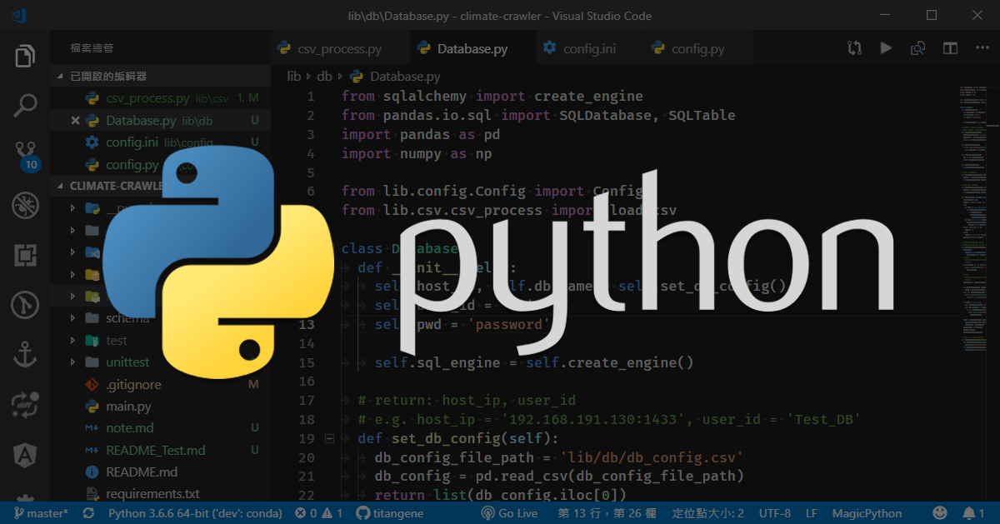

開發 Python 時，很常使用 `print()` 來輸出變數以方便 debug，但要部署時，不需要這些訊息，需要自己手動去註解或刪除那些放在各處的 `print()`。而 Python 內建提供了 `logging` 模組可以用來取代 `print()`，`logging` 除了可以輸出訊息，也可以將訊息儲存至日誌檔保存。下面紀錄如何使用 `logging` 模組。

<!-- more -->

## 載入 logging 模組

```python
import logging
```

## logging 等級

`logging` 模組預先定義了 6 種等級以及對應的 log 輸出函數 (除了 `logging.NOTSET` 沒有對應的輸出函數)：

等級 | 等級數值 | 輸出函數 | 說明
--- | --- | --- | --- | ---
NOTSET   | 0  | 無對應的輸出函數        | 未設定
DEBUG    | 10 | `logging.debug()`    | 除錯
INFO     | 20 | `logging.info()`     | 訊息
WARNING  | 30 | `logging.warning()`  | 警告
ERROR    | 40 | `logging.error()`    | 錯誤
CRITICAL | 50 | `logging.critical()` | 嚴重錯誤

若要查詢各等級的數值，可直接呼叫該等級：

```python
import logging

print(logging.NOTSET)   # 0
print(logging.DEBUG)    # 10
print(logging.INFO)     # 20
print(logging.WARNING)  # 30
print(logging.ERROR)    # 40
print(logging.CRITICAL) # 50
```

若要用等級數值來查詢是哪個等級的訊息，可使用 `logging.getLevelName(level)`：

```python
import logging

print(logging.getLevelName(0))    # NOTSET
print(logging.getLevelName(10))   # DEBUG
print(logging.getLevelName(20))   # INFO
print(logging.getLevelName(30))   # WARNING
print(logging.getLevelName(40))   # ERROR
print(logging.getLevelName(50))   # CRITICAL
```

## 輸出 logging

`logging` 模組預設等級為 `WARNING`，大於或等於 `WARNING` 等級的訊息才會被記錄：

```python
import logging

logging.debug('debug message')
logging.info('info message')
logging.warning('warning message')
logging.error('error message')
logging.critical('critical message')
```

下面是輸出結果，可以看到比 `WARNING` 等級還要低的訊息有 `DEBUG` 和 `INFO` 就不會被輸出：

```shell
WARNING:root:warning message
ERROR:root:error message
CRITICAL:root:critical message
```

若將等級設為 `DEBUG`，就會將所有等級的訊息都輸出：

```python
import logging

logging.basicConfig(level=logging.DEBUG)

logging.debug('debug message')
logging.info('info message')
logging.warning('warning message')
logging.error('error message')
logging.critical('critical message')
```

下面是輸出結果，預設的訊息輸出格式是 `%(levelname)s:%(name)s:%(message)s` (後面會介紹如何自訂輸出格式)：

```shell
DEBUG:root:debug message
INFO:root:info message
WARNING:root:warning message
ERROR:root:error message
CRITICAL:root:critical message
```

### 自訂 logging 輸出格式
預設的訊息輸出格式只有 `levelname`、`name`、`message`，下面是其他相關的資訊：

格式化字串        |  說明
--------------- | ---
`%(asctime)s`     |  日期時間, 格式為 `YYYY-MM-DD HH:mm:SS,ms`，例如：2018-12-13 17:20:30,567
`%(filename)s`    |  模組檔名
`%(funcName)s`    |  函數名稱
`%(levelname)s`   |  日誌的等級名稱
`%(levelno)s`     |  日誌的等級數值
`%(lineno)d`      |  呼叫日誌函數所在的行數
`%(message)s`     |  訊息
`%(module)s`      |  模組名稱
`%(name)s`        |  logger 的名稱
`%(pathname)s`    |  檔案的完整路徑 (如果可用)
`%(process)d`     |  process ID (如果可用)
`%(thread)d`      |  執行緒 ID (如果可用)
`%(threradName)s` |  執行緒名稱

可將這些資訊加入 `logging.basicConfig()` 內的 `format` 參數：

```python
FORMAT = '%(asctime)s %(levelname)s: %(message)s'
logging.basicConfig(level=logging.DEBUG, format=FORMAT)

logging.debug('debug message')
logging.info('info message')
logging.warning('warning message')
logging.error('error message')
logging.critical('critical message')
```

下面是自訂訊息的輸出結果：

```shell
2018-12-13 17:40:34,604 DEBUG: debug message
2018-12-13 17:40:34,604 INFO: info message
2018-12-13 17:40:34,604 WARNING: warning message
2018-12-13 17:40:34,604 ERROR: error message
2018-12-13 17:40:34,608 CRITICAL: critical message
```

## 儲存 logging
只要在 `logging.basicConfig()` 內的 `filename` 參數設定要儲存的日誌檔名，就可以將 logging 儲存：

```python
FORMAT = '%(asctime)s %(levelname)s: %(message)s'
logging.basicConfig(level=logging.DEBUG, filename='myLog.log', filemode='w', format=FORMAT)

logging.debug('debug message')
logging.info('info message')
logging.warning('warning message')
logging.error('error message')
logging.critical('critical message')
```

預設 `filemode` 參數是設為 `a`，代表 append (附加) 的意思，每次執行程式時，Logging 會將新的訊息加在舊的訊息後面，不會覆蓋舊的訊息。若要改成新訊息覆蓋就訊息，那可以將 `filemode` 參數設為 `w`，代表 write 的意思。

下面是剛剛執行後儲存的 `myLog.log` 日誌檔：

```log
2018-12-13 17:47:18,686 DEBUG: debug message
2018-12-13 17:47:18,687 INFO: info message
2018-12-13 17:47:18,687 WARNING: warning message
2018-12-13 17:47:18,687 ERROR: error message
2018-12-13 17:47:18,687 CRITICAL: critical message
```

> 詳情可參考官方文件 [Logging facility for Python — Python documentation](https://docs.python.org/3/library/logging.html)。