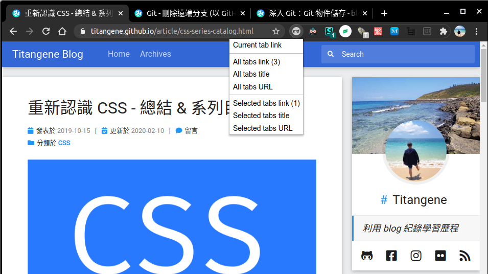
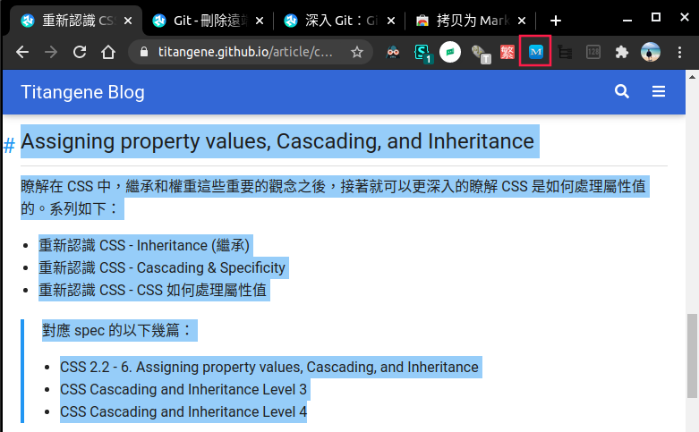
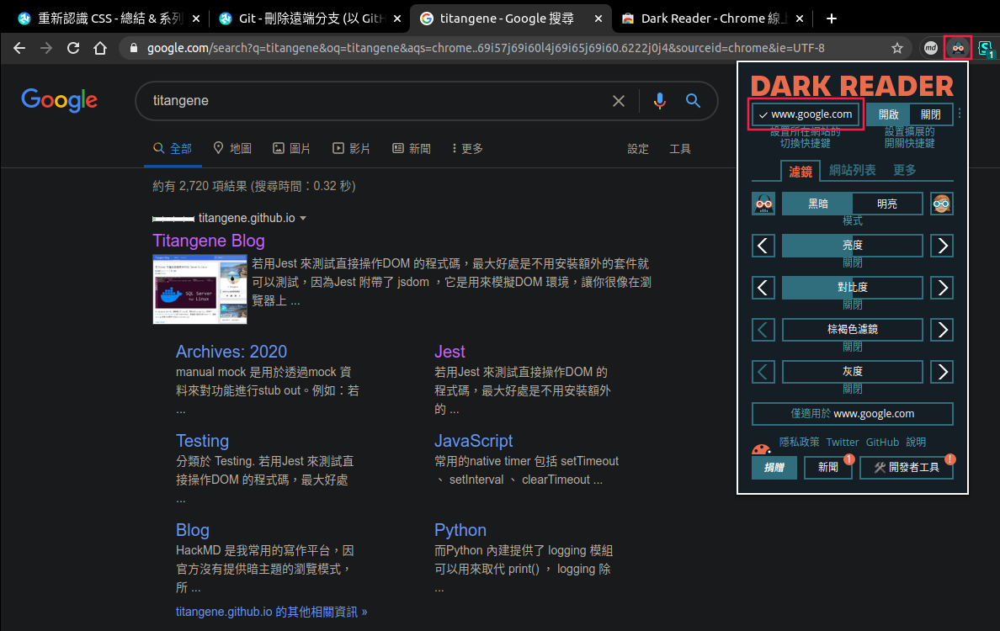
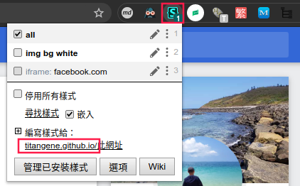
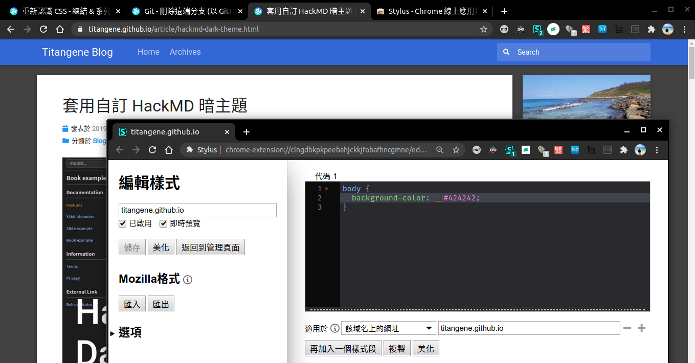
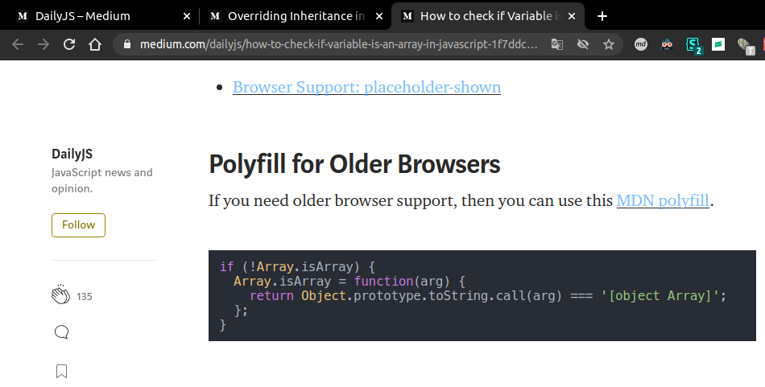
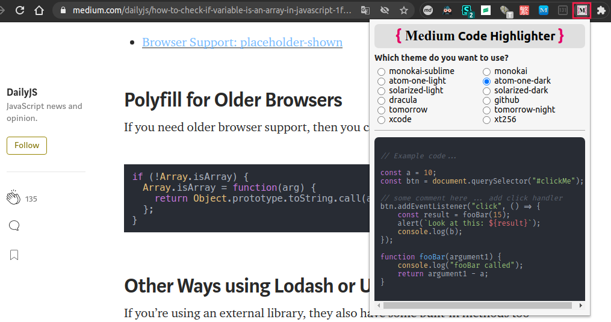

本篇推薦一些我常用的 Chrome Extension，包含複製分頁的 Markdown 格式的連結、將頁面變為暗主題。

<!-- more -->

> 其他推薦 Chrome Extension 相關文章可參閱 [推薦 Chrome Extension 系列文章](https://titangene.github.io/tags/chrome-extension/)。

# Markdown

## Copy as Markdown

下載連結：[Copy as Markdown](https://chrome.google.com/webstore/detail/fkeaekngjflipcockcnpobkpbbfbhmdn)

功能：
- 複製當前分頁的 Markdown 格式的連結
- 複製該視窗的所有分頁的 Markdown 格式的連結

點擊 Extension 的圖案，可看到多種選項功能。其中的「Current tab link」選項會將該分頁連結的 Markdown 格式複製至剪貼簿。

假設要複製此 blog 文章的連結，剪貼簿內儲存的連結格式如下：

```
[重新認識 CSS - 總結 & 系列目錄 | Titangene Blog](https://titangene.github.io/article/css-series-catalog.html)
```

此 Extension 會將頁面標題 (即 `<title>` 標籤的內容) 和連結變為 Markdown 格式。



還有更厲害的！點擊「All tab link (n)」選項會複製該視窗的所有分頁連結，並以 Markdown 的無序清單的形式 (即 `*` ) 複製至剪貼簿。

以上圖為例，此視窗開了 3 個分頁，所以我點擊「All tab link (n)」選項會複製以下內容：

```
* [重新認識 CSS - 總結 & 系列目錄 | Titangene Blog](https://titangene.github.io/article/css-series-catalog.html)
* [Git - 刪除遠端分支 (以 GitHub、GitLab 為例) | Titangene Blog](https://titangene.github.io/article/git-delete-remote-branch.html)
* [深入 Git：Git 物件儲存 - blob 物件 | Titangene Blog](https://titangene.github.io/article/git--blob-object.html)
```

如果只想要複製標題或連結而已，可以點擊「All tab title」或「All tab URL」選項。格式如下：

```
* 重新認識 CSS - 總結 & 系列目錄 | Titangene Blog
* Git - 刪除遠端分支 (以 GitHub、GitLab 為例) | Titangene Blog
* 深入 Git：Git 物件儲存 - blob 物件 | Titangene Blog
```

```
* https://titangene.github.io/article/css-series-catalog.html
* https://titangene.github.io/article/git-delete-remote-branch.html
* https://titangene.github.io/article/git--blob-object.html
```

寫 Markdown 筆記時，若想一次複製多個分頁的連結，並且是 Markdown 格式，用了這個「Copy as Markdown」Extension 就不用自己手動打了！

## 拷貝為 Markdown

下載連結：[拷貝為 Markdown](https://chrome.google.com/webstore/detail/copy-as-markdown/dgoenpnkphkichnohepecnmpmihnabdg)

功能：將選取的內容轉為 Markdown 格式

假設我要複製以下選取的內容，並且可以取得 Markdown 格式，只要選取該內容後，並點擊 Extension 的圖案，就會將內容複製至剪貼簿：



複製的內容如下。可以看到連標題 (即 `##` )、無序列表 (即 `*` )、引用 (即 `>` ) 都能自動轉成 Markdown 格式：

```
## Assigning property values, Cascading, and Inheritance

瞭解在 CSS 中，繼承和權重這些重要的觀念之後，接著就可以更深入的瞭解 CSS 是如何處理屬性值的。系列如下：

* [重新認識 CSS - Inheritance (繼承)](https://titangene.github.io/article/css-inheritance.html)
* [重新認識 CSS - Cascading & Specificity](https://titangene.github.io/article/css-cascading-and-specificity.html)
* [重新認識 CSS - CSS 如何處理屬性值](https://titangene.github.io/article/css-value-processing.html)

> 對應 spec 的以下幾篇：
>
> * [CSS 2.2 - 6. Assigning property values, Cascading, and Inheritance](https://www.w3.org/TR/CSS22/cascade.html)
> * [CSS Cascading and Inheritance Level 3](https://www.w3.org/TR/css-cascade-3/)
> * [CSS Cascading and Inheritance Level 4](https://www.w3.org/TR/css-cascade-4/)
```

# 頁面主題

## Dark Reader

下載連結：[Dark Reader](https://chrome.google.com/webstore/detail/dark-reader/eimadpbcbfnmbkopoojfekhnkhdbieeh)

功能：將頁面變成暗主題、護眼模式

點擊 Extension 的圖案會開啟設定視窗，點擊左上角的按鈕就可以啟用暗主題。

它會自動偵測需要改變的顏色，大致上的目標是黑底白字。

像下圖就是 Google 搜尋頁面的暗主題模式，你也可以自訂亮度、對比度等設定。

你可對每個網站設定不同的設定，例如：A 網站要開啟暗主題，但 B 網站關閉暗主題。



## Stylus

下載連結：[Stylus](https://chrome.google.com/webstore/detail/stylus/clngdbkpkpeebahjckkjfobafhncgmne)

功能：在各自頁面自訂 CSS 樣式，即客製化主題

之前在「[套用自訂 HackMD 暗主題](https://titangene.github.io/article/hackmd-dark-theme.html)」就有提供這個 Extension，當時我為 HackMD 客製化了暗主題。

當然你也可以在你希望的網頁上自訂 CSS，例如：
- 頁面的字太小，所以自己設定 `font-size` 放大
- 文章連結沒有底線，看不出與無連結文字的差別，所以自己為設定了 `a { text-decoration: underline; }`
- ...等

那如何各別網站設定自訂的 CSS 呢？只要點擊 Extension 的圖案，並點擊「編寫樣式給：」下面的網址連結，就會為該網站開啟自訂 CSS 的編輯器：



接著就可以開始寫自訂 CSS 了。像下圖是我自訂本 blog 的背景顏色改為灰黑色，只要儲存就能成功套用：



如果想將自己自訂的 CSS 分享給別人，可將設定上傳至 [Userstyles.org](https://userstyles.org/) 這個網站讓別人下載套用。

## Medium Code Highlighter

下載連結：[Medium Code Highlighter](https://chrome.google.com/webstore/detail/medium-code-highlighter/apdaagmhepellbjjbnaljaocodjjjjfd)

功能：highlight Medium 文章內的程式碼

找資料時，常會看到 Medium 的文章，但他的程式碼區塊沒有提供 code highlight 功能。

使用此 Extension 就能 highlight Medium 文章內的程式碼：



而且還能自己選主題：


