本篇推薦一些我常用的 Chrome Extension，包含隨機風景照的新分頁、隨機小知識的新分頁，以及能列出訂閱技術文章的新分頁。

<!-- more -->

> 其他推薦 Chrome Extension 相關文章可參閱 [推薦 Chrome Extension 系列文章](https://titangene.github.io/tags/chrome-extension/)。

# 新分頁

「起始分頁」就是當你打新分頁時，顯示的那個分頁。

預設的新分頁很簡潔~~簡陋~~，有 Google 搜尋、常用頁面。沒了...

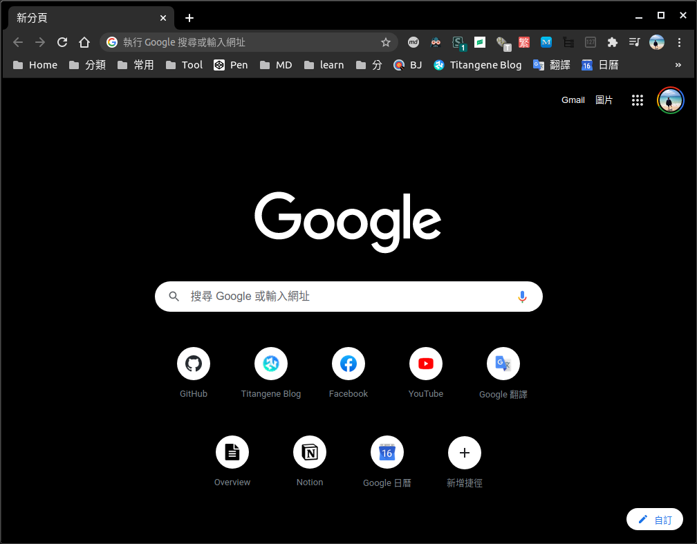

當然你可以點擊右下角的「自訂」來設定背景、快速鍵 (設定捷徑、常看的網站)、顏色和主題：

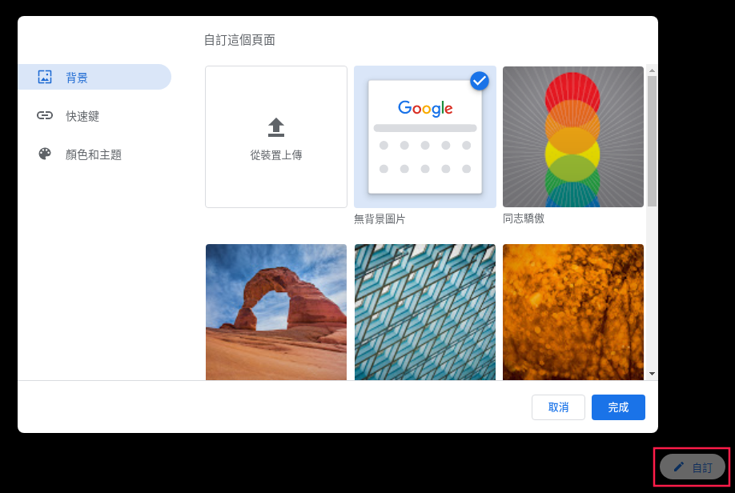

每次只能看純顏色的背景，或是一樣的背景圖，看膩了還要自己換！

有沒有會幫你自動換漂亮風景照的工具？那我最推的就是「Unsplash Instant」。

## Unsplash Instant

下載連結：[Unsplash Instant](https://chrome.google.com/webstore/detail/unsplash-instant/pejkokffkapolfffcgbmdmhdelanoaih)

功能：
- 隨機照片：每次開新分頁都會看到不同的照片
- 下載照片：若看到喜歡的照片，可下載至電腦，甚至設為桌布

Unsplash 是蠻有名的高解析度免費圖庫平台，每張照片採用的授權很自由，任何人都可將照片自由使用至任何目的 (免費下載和使用、用於商業和非商業目的、不需許可)。

而這個 extension 就是由 Unsplash 官方推出的！只要安裝此 extension，你開的新分頁就會是隨機漂亮的照片了！

如果你不小心將快速開啟的新分頁關閉了，不用擔心，此 extension 有提供歷史紀錄，可以讓你看前兩張照片：

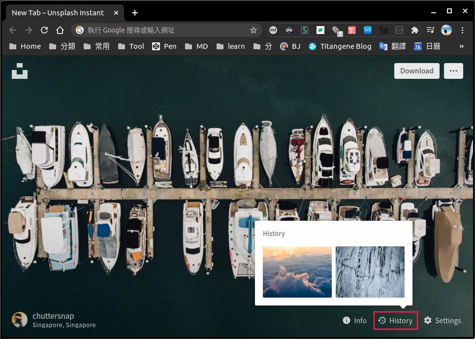

若要下載照片，只要點擊右上角的「Download」即可。若要查看原照片連結，只要點擊左上角的 icon 即可跳至該連結。

剛剛介紹了美化的新分頁，那接著來介紹能讓你提昇開發技能的 extension。

## 30 Seconds of Knowledge

下載連結：[30 Seconds of Knowledge](https://chrome.google.com/webstore/detail/30-seconds-of-knowledge/mmgplondnjekobonklacmemikcnhklla)

功能：
- 提供多種程式語言的知識：包含 C++、CSS、JavaScript、PHP、Python、Ruby、React、Ramda、面試題等
- 隨機小知識：每次開新分頁都會看到不同的知識，就如其名，只需要 30 秒就能閱讀完並理解
- 儲存 snippet：若看到不錯的小知識，可儲存下來之後閱讀

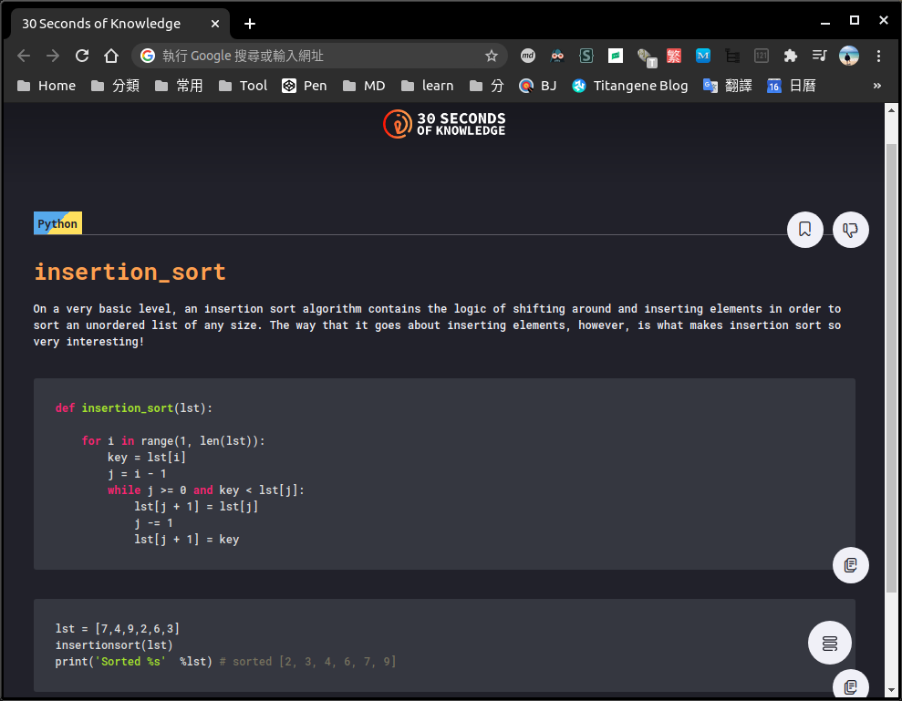

儲存下來的 snippet 會放在右下角的選單 icon，裡面的第一個 icon：

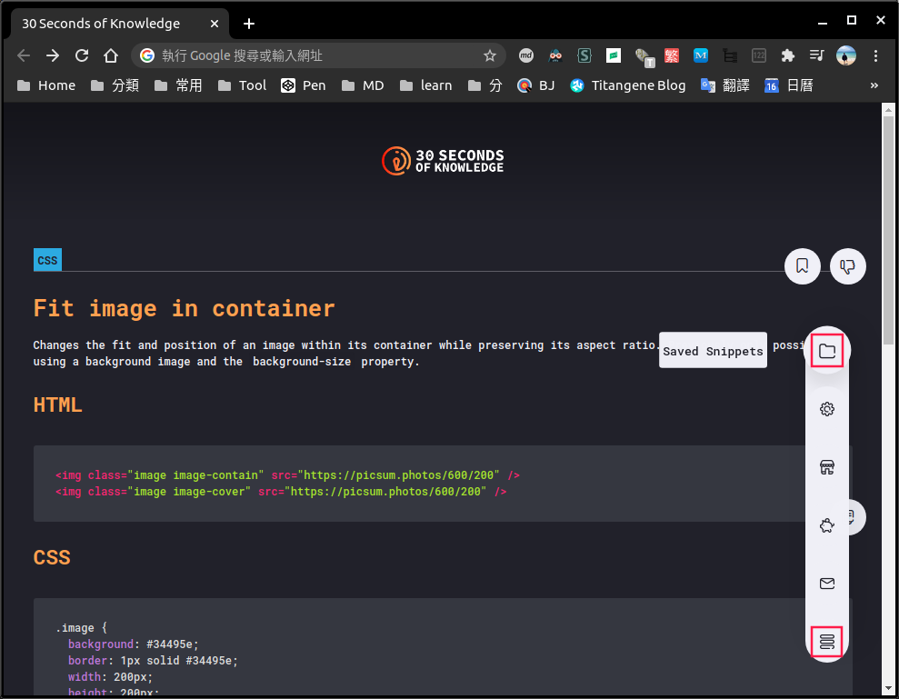

像下圖就是我儲存的 snippet：

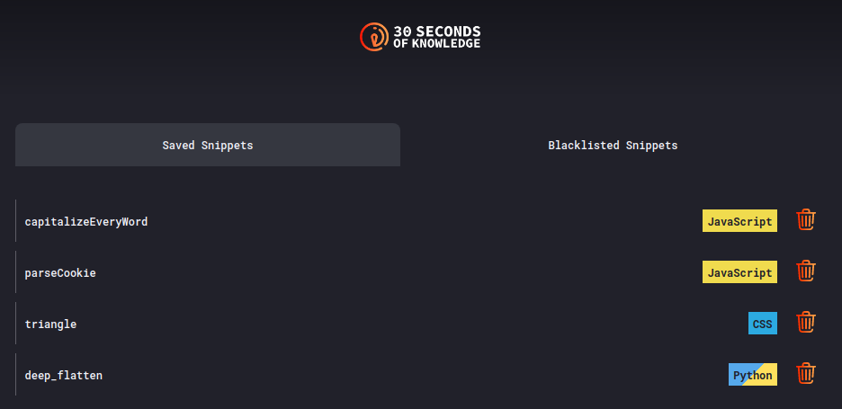

此 extension 也提供一些設定，包括：
- 選擇要看的程式語言主題
- 主題：暗/亮
- 字體大小

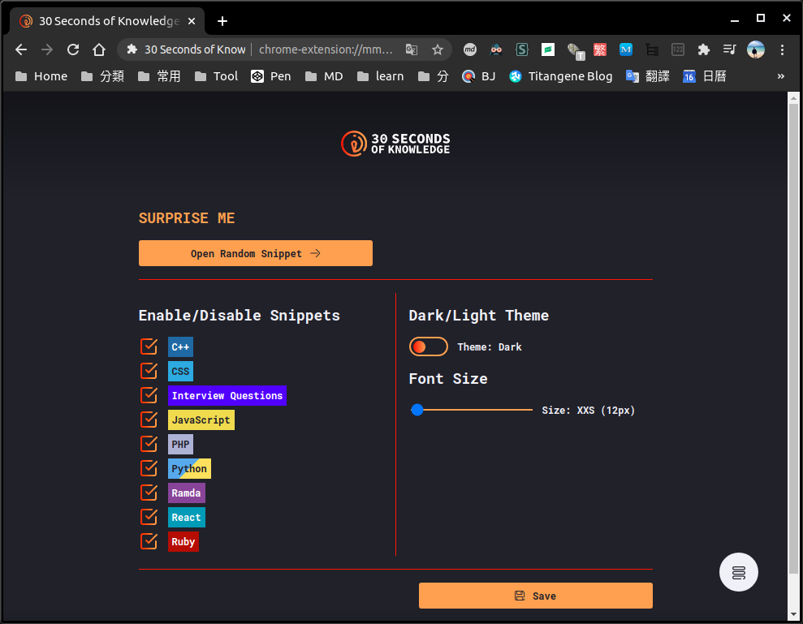

若覺得小知識不能滿足你，你想訂閱更多文章和新的技術資訊，那「daily.dev」一定很適合你！

## daily.dev - News for Busy Developers

下載連結：[daily.dev - News for Busy Developers](https://chrome.google.com/webstore/detail/dailydev-news-for-busy-de/jlmpjdjjbgclbocgajdjefcidcncaied)

功能：
- 隨時接收最新的文章和技術資訊：新文章都會列在新分頁上
- 可選擇要訂閱的網站或 tag
- [開源](https://github.com/dailydotdev/daily)：若有 bug，歡迎大家貢獻

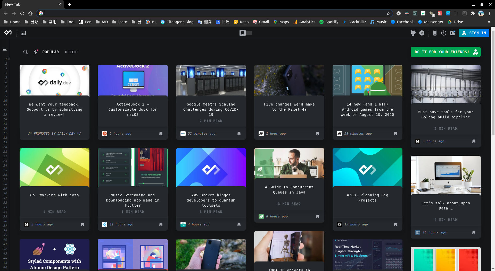

左邊的選單可讓你選擇要訂閱的來源，可以是網站或 tag：

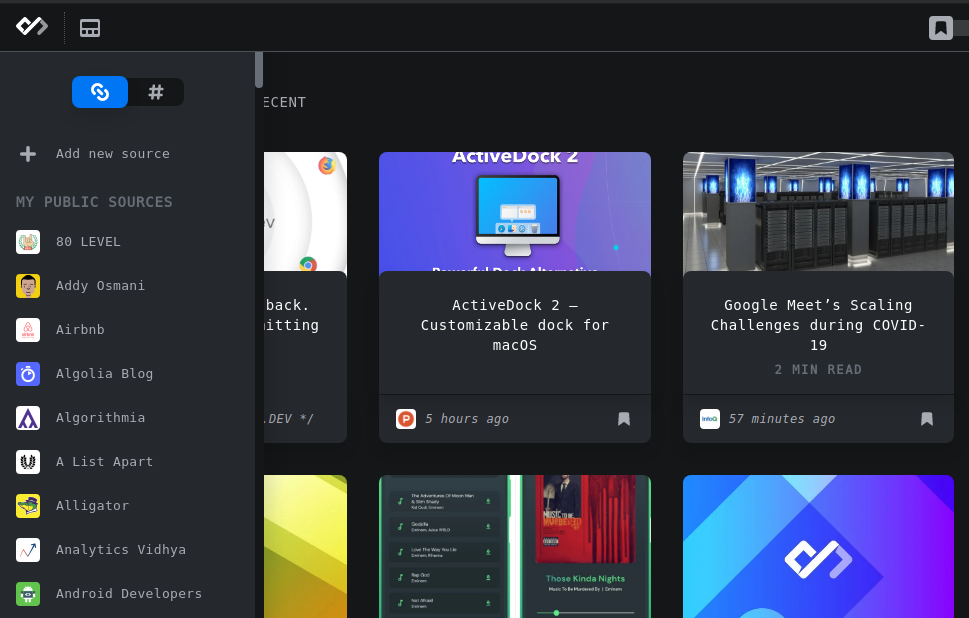

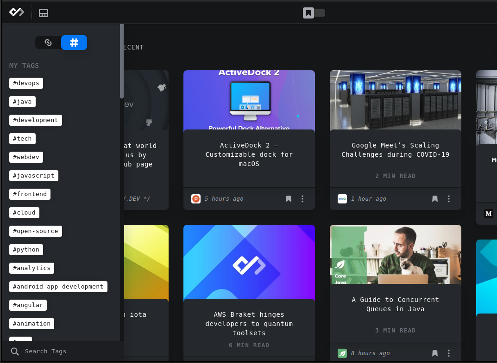

若有喜歡或是想稍後閱讀的文章，可加入書籤保存：

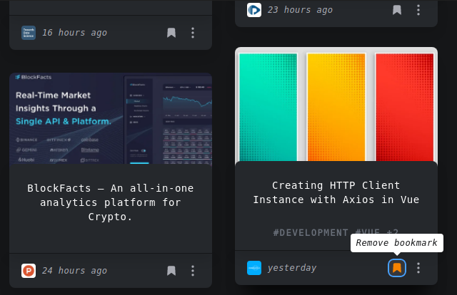

像下圖就是我保存的文章：

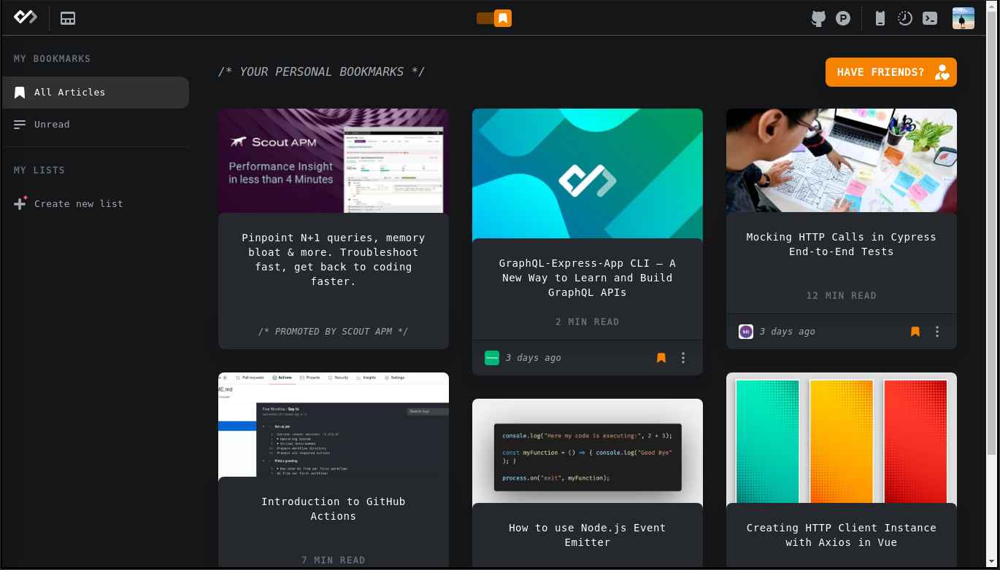

有一些是付費功能，例如：自己新增來源，可以是 blog 或 RSS 網址。歡迎大家把我的「Titangene Blog」的 RSS 網址訂閱起來 XD：https://titangene.github.io/atom.xml

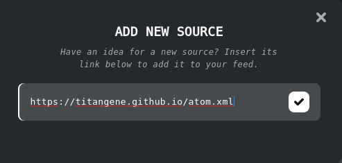

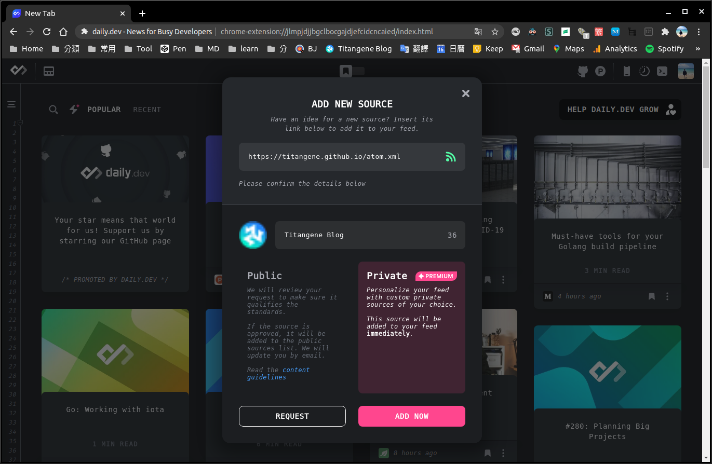