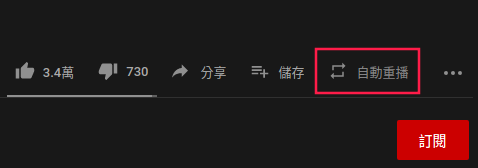
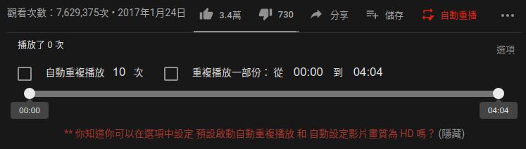
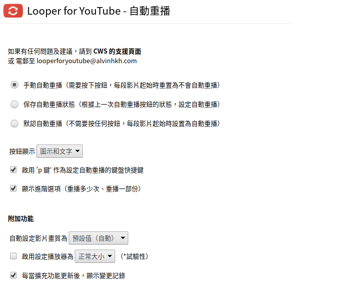
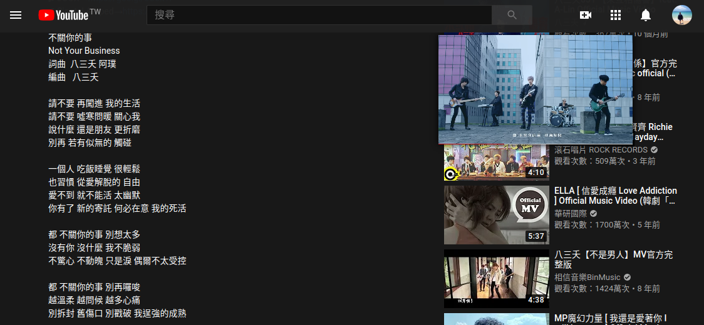
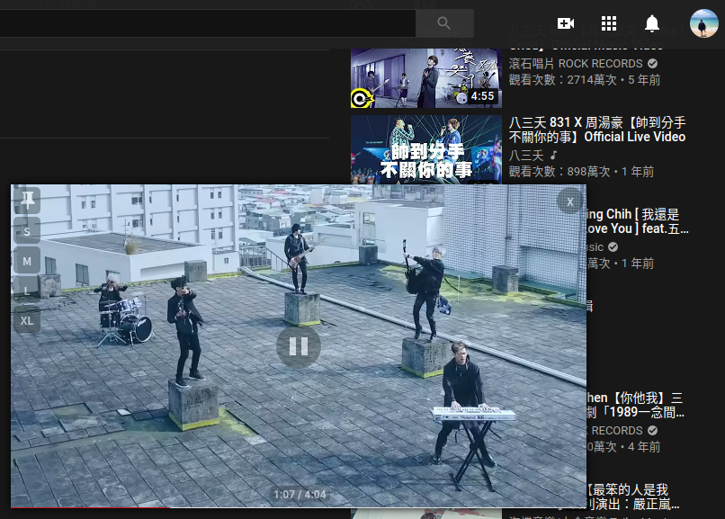

本篇推薦一些我常用的 Chrome Extension，包含自動重播 YouTube 影片，以及把 YouTube 影片變成漂浮視窗，能讓你邊看影片時還能邊看其他內容。

<!-- more -->

> 其他推薦 Chrome Extension 相關文章可參閱 [推薦 Chrome Extension 系列文章](https://titangene.github.io/tags/chrome-extension/)。

# Looper for YouTube - 自動重播

下載連結：[Looper for YouTube - 自動重播](https://chrome.google.com/webstore/detail/looper-for-youtube/iggpfpnahkgpnindfkdncknoldgnccdg)

功能：
- 自動重播 YouTube 影片
- 可自訂重播幾次
- 可自訂重播某片段
- 可自訂影片在重播時的畫質

我常用 YouTube 來聽歌，若希望重播某首音樂來讓自己進入心流狀態，那此 extension 就能輕鬆達到這個需求，讓你不用手動重新播放 YouTube，專住在要做的事上。

按下「自動重播」就會無限次的自動重播該 YouTube 影片，此時 YouTube 播放清單的自動播放就會被禁用：

也可自訂重播幾次，以及重播某片段：

在選項內還有其他設定，包括影片在重播時的畫質：

# Mini Y

下載連結：[Mini Y](https://chrome.google.com/webstore/detail/mini-y/acphfpihfjpgnihkgelafhmjeoodbehp)

功能：將 YouTube 影片變成漂浮視窗

你在播放 YouTube 影片時有以下需求嗎：
- 邊看影片，邊看影片底下的敘述內容 (例如：音樂歌詞)
- 邊看影片，邊看影片底下的留言
- 邊看影片，邊看右側的推薦影片

這個 extension 就解決了這些需求！

當你將畫面往下捲動，它會將 YouTube 影片變成漂浮視窗放在一側：

而且你在 hover 該漂浮影片時，可讓你自由選擇漂浮視窗要改變的大小：

而且還可隨意將漂浮視窗拖曳至你喜歡的位置：

