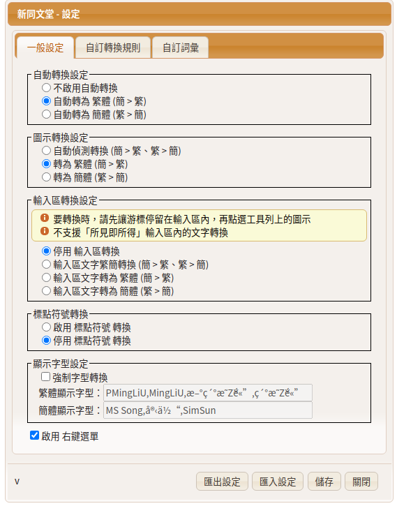
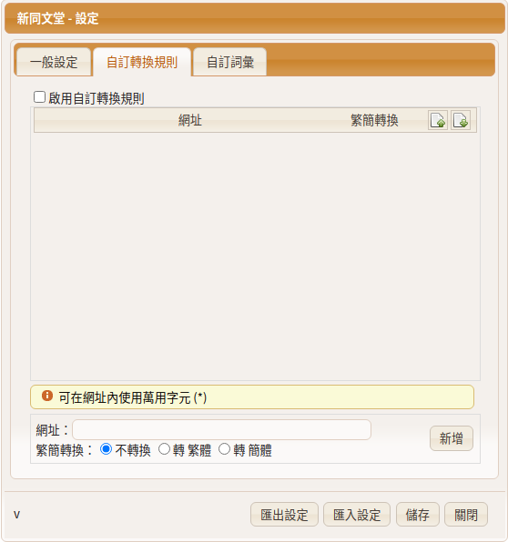
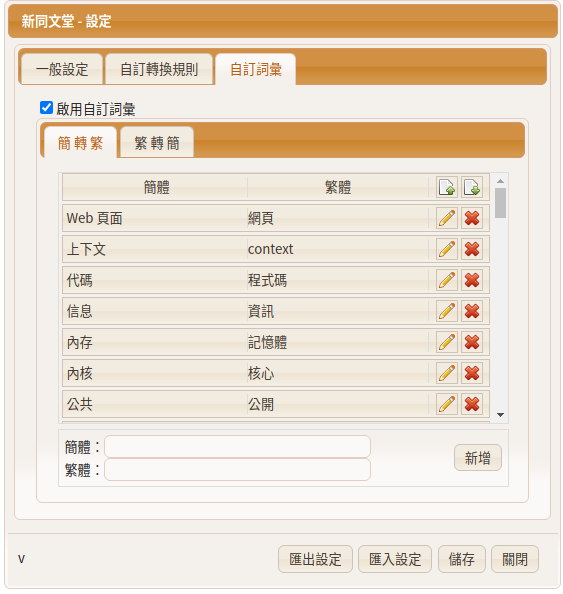
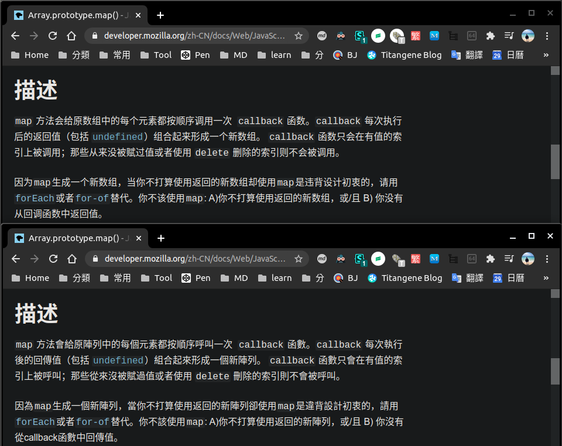

本篇推薦我常用的 Chrome 翻譯 Extension：新同文堂。它不是像 Google 翻譯那樣單純的英翻中或簡轉繁，而是可以自訂指定的簡中用語轉成繁中用語，並能在任何/指定頁面自動將中國用語轉成台灣用語。

<!-- more -->

> 其他推薦 Chrome Extension 相關文章可參閱 [推薦 Chrome Extension 系列文章](https://titangene.github.io/tags/chrome-extension/)。

[Google 翻譯](https://chrome.google.com/webstore/detail/google-translate/aapbdbdomjkkjkaonfhkkikfgjllcleb) Extension 沒什麼好介紹的，大家都很熟悉了，但有一些缺點：
- 近期的英翻中大多都是中國用語，與我們日常使用的用語不同
- 只能簡中轉成繁中，但無法將中國用語轉成台灣用語

雖然常看這些用語已經能在腦中自動翻譯了，但在閱讀上還是會有一些不習慣。

如果網頁能自動轉換成台灣用語那就太好啦！而「新同文堂」就能解決這個問題！

# 新同文堂

下載連結：[新同文堂](https://chrome.google.com/webstore/detail/new-tong-wen-tang/ldmgbgaoglmaiblpnphffibpbfchjaeg)

功能：
- 自訂指定的簡中用語轉成繁中用語
- 開啟任何/指定頁面都能自動將中國用語轉成台灣用語

「一般設定」內有很多可以選項設定，包括是否啟動自動轉換、標點符號轉換、字型轉換...等：

「自訂轉換規則」則是可自訂哪些網站是否要套用繁簡轉換的規則：

而「自訂詞彙」就是可依你習換的用語來設定：

像下面就是我自訂的詞彙，歡迎大家匯入使用：

另外，也可參考其他人的設定：
- [doggy8088/newtongwen-settings](https://github.com/doggy8088/newtongwen-settings)
- [cn2tw4programmer/_newTongWenTang.json at master · pjchender/cn2tw4programmer](https://github.com/pjchender/cn2tw4programmer/blob/master/src/terms/_newTongWenTang.json)

實際用起來會像下圖這樣，上面是原本的中國用語，下面是透過新同文堂自動轉為台灣用語：

