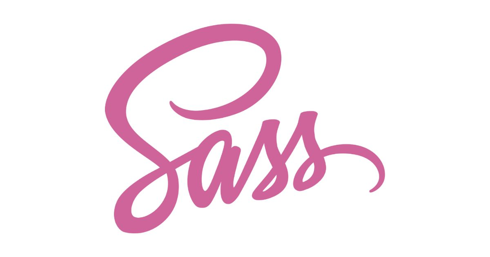

若要模組化 Sass，最常用的就是 `@import` 規則。但在 [Dart Sass](https://titangene.github.io/article/dart-sass.html) 推出了一個新功能：模組系統，可用 `@use` 規則，並透過 namespace 來引入其他 stylesheet 中的成員。

<!-- more -->

# Overview

- 載入其他 Sass stylesheet 中的 mixin、函數和變數，並將多個 stylesheet 中的 CSS 組合在一起
- 不管用 `@use` 載入幾次的任何樣式，都只會在編譯的 CSS 輸出中出現一次
- `@use` 必須放在所有規則之前 (除了 `@forward` 和變數宣告之外)
- 便於了解成員是從哪些檔案載入的
- 不用像使用 `@import` 時那樣，需把命名寫清楚，因為可透過 `@use` 提供的 namespace 來避免命名衝突 


:::info
只要使用 `@use` 引入的檔案，stylesheet 就會被全部引入，不管有無另外使用。
:::

# 語法

```scss
@use "<url>";

@use "<url>" as <namespace>;
@use "<url>" as *;

@use "<url>" with (
  <variable>: <value>,
  <variable>: <value>
);
```

# 載入成員

- 用 `@use` 載入的 stylesheet 稱為「modules (模組)」。
- 使用 `@use` 時，可透過 namespace 來存取另一個模組中的變數、函數和 mixin：
  - 變數：`<namespace>.<variable>`
  - 函數：`<namespace>.<function>()`
  - mixin：`@include <namespace>.<mixin>()`
- 預設的 `<namespace>` 就是模組 URL 的檔名 (不包含 `_` 底線前綴和副檔名)
- 用 `@use` 載入的成員有存取範圍，只有載入它們的 stylesheet 才能存取
  - 若其他 stylesheet 想存取這些成員，就必須自己寫 `@use` 載入

例如：用 `@use` 引入的 `styles/base/_color.scss` 檔案會像下面這樣，而此模組的 namespace 就是 `color`：

```scss
// styles/base/_color.scss
$blue: #2979ff;
```

```scss
// styles/_tool.scss
@mixin rounded {
  border-radius: 3px;
}

@function px2em($pixel, $font-size-base: 16px) {
  @return ($pixel / $font-size-base) * 1em;
}
```

```scss
// styles/main.scss
@use "base/color";
@use "tool";

.button {
  padding: 10px;
  color: color.$blue;
  font-size: tool.px2em(32px);
  @include tool.rounded;
}
```

輸出：

```css
.button {
  padding: 10px;
  color: #2979ff;
  font-size: 2em;
  border-radius: 3px;
}
```

# 設定 namespace

語法：

```scss
@use "<url>" as <namespace>;
@use "<url>" as *;
```

自訂 namespace (很像設定 alias) 的情境：
- 載入相同檔名的多個模組 (例如：第三方 library 和我的檔名相同)
- 讓模組的名稱變短

```scss
// src/_mycolor.scss
$blue: #2979ff;
```

```scss
// src/main.scss
@use "src/mycolor" as color;

.button {
  color: color.$blue;
}
```

輸出：

```css
.button {
  color: #2979ff;
}
```

也可用 `*` 來載入沒有 namespace 的模組，但建議使用在自己寫的 stylesheet 或 [Sass 提供的內建模組](https://sass-lang.com/documentation/modules)，以避免引入名稱衝突的成員：

例如：

```scss
@use 'sass:math' as *;

$half: percentage(1/2);

.button {
  border-radius: $half;
}
```

輸出：

```css
.button {
  border-radius: 50%;
}
```

# 私有成員

若你不想讓你定義的所有成員都可在 stylesheet 之外使用，就可在成員名稱的前面加上 `-` 或 `_`，來讓它們變成私有成員。

```scss
// styles/_corner.scss
$_radius: 3px;

@mixin rounded {
  border-radius: $_radius;
}
```

```scss
// styles/main.scss
@use "corner";

.button {
  border-radius: corner.rounded;
  padding: corner.$_radius;  // Error
}
```

編譯會報錯：

```shell
$ npx sass styles:dict/styles
Error: Private members can't be accessed from outside their modules.
  ╷
5 │   padding: corner.$_radius;
  │            ^^^^^^^^^^^^^^^
  ╵
  src/scss/main.scss 5:12  root stylesheet
```

# 配置模組

stylesheet 可用 [`!default` flag](https://sass-lang.com/documentation/variables#default-values) 來定義變數，會被新的值給覆蓋。

若要載入帶有配置的模組，可用以下語法：

```scss
@use "<url>" with (
  <variable>: <value>,
  <variable>: <value>
);
```

配置的值會覆蓋變數的預設值。

例如：

```scss
// styles/base/_color.scss
$blue: #2979ff !default;
$red: #f44336 !default;

$primary: $blue;
$secondary: $red;
```

```scss
// styles/main.scss
@use "base/color" with (
  $blue: #00f,
  $red: #f00
);

.button-primary {
  background-color: color.$primary;
}

.button-secondary {
  background-color: color.$secondary;
}
```

輸出：

```css
.button-primary {
  background-color: #00f;
}

.button-secondary {
  background-color: #f00;
}
```

資料來源：
- [Sass: @use](https://sass-lang.com/documentation/at-rules/use#configuring-modules)