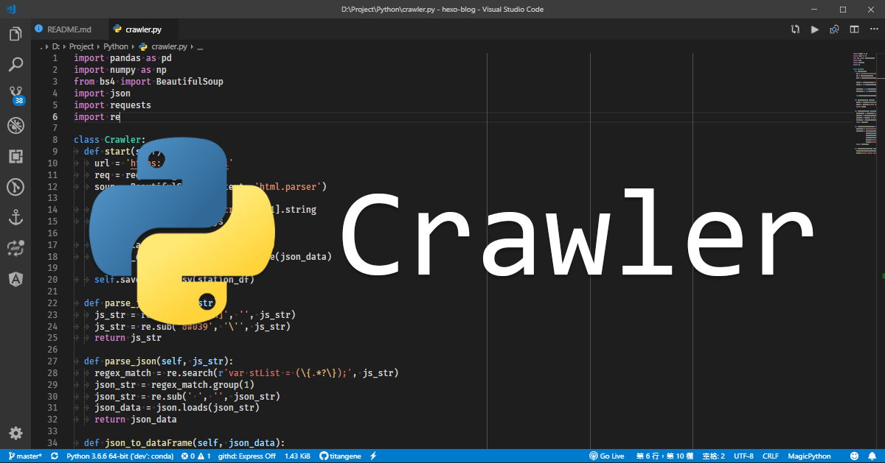

如何將 Python 爬蟲程式定期執行？使用 Windows 的使用者可以選擇「工作排程器」來解決。

<!-- more -->

最近有些資料想透過爬蟲來擷取，而且希望可以定期 (例如：每 10 分鐘一次) 自動執行爬蟲程式，因此就有了這篇筆記。下面介紹如何以 Windows 工作排程器來定期執行爬蟲程式。

## 目標
每 10 分鐘自動執行 Python 爬蟲程式，將爬蟲抓到的最新降雨量資料存入 CSV 檔內收集。

## 準備
- Windows
- Python 環境：建議安裝 Anaconda，可參考 [用 Conda 建立虛擬環境和管理相依套件](./create-a-virtual-environment-and-manage-dependencies-with-conda.html)
- Python 套件 (這是本篇爬蟲範例所需的相依套件，可依各自需求來選擇)
  - [Pandas](https://pandas.pydata.org/)
  - [Numpy](http://www.numpy.org/)
  - [Requests](http://docs.python-requests.org/en/master/)

## Python 爬蟲程式原始碼
source code: [titangene/cwb-opendata-crawler-demo/crawler.py](https://github.com/titangene/cwb-opendata-crawler-demo/blob/master/crawler.py)

簡單說明一下程式的執行步驟：
1. 利用 Python 的 [Requests](http://docs.python-requests.org/en/master/) 套件來建立 HTTP 的 GET 請求，從中央氣象局提供的開放資料 API 中取得資料，回傳的格式是 JSON
2. 解析 API 回傳的 JSON 資料，並將 JSON 轉成 [Pandas](https://pandas.pydata.org/) 的 `DataFrame` 型別的資料格式
3. 將 `DataFrame` 儲存成 CSV 檔保存資料

> 若想了解中央氣象局開放資料的相關內容，詳情可參考 [中央氣象局開放資料 - 開發指南](https://opendata.cwb.gov.tw/devManual/insrtuction)。

## Python 爬蟲程式的批次檔
建立一個副檔名為 `.bat` 的批次檔，批次檔是用來執行 Python 爬蟲程式，因此就能讓 Windows 工作排程器在定期時間自動執行批次檔，以達成自動化執行爬蟲的目的。

下面就來說明批次檔每行都做了甚麼：
- 第一行：切到指定目錄
- 第二行：指定 Python 虛擬環境 (可參考 [用 Conda 建立虛擬環境和管理相依套件](./create-a-virtual-environment-and-manage-dependencies-with-conda.html)。如果要在全域環境下執行就不需要這行)
- 第三行：執行 Python 爬蟲程式
- 第四行：若想查看 Python 爬蟲程式執行過程中所輸出 (也就是執行 `print` 方法的部分) 內容，就需要取消這行的註解
  - `REM`：單行註解
  - `pause`：用來暫停批次檔的執行

```shell
cd /d D:/Project/Python/cwb-opendata-crawler
call activate dev
call python crawler.py
REM pause
```

source code: [titangene/cwb-opendata-crawler-demo/crawler.bat](https://github.com/titangene/cwb-opendata-crawler-demo/blob/master/crawler.bat)

## Windows 工作排程器 簡介
可預先設定工作在特定時間或指定時間時，會自動執行程式或批次檔以達成工作自動化。下圖為 Windows 10 的工作排程器介面：

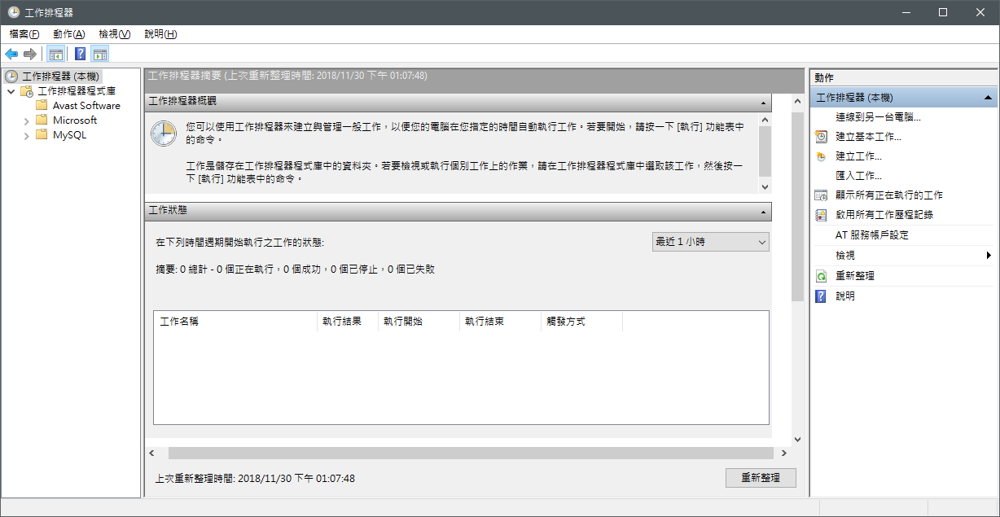

## 建立工作，設定定期執行爬蟲程式
開啟 Windows 的「工作排程器」，點擊右上角的「建立工作」

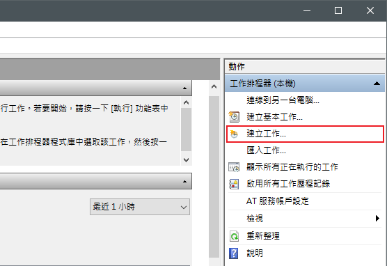

自訂工作名稱，若有權限需求可勾選「以最高權限執行」選項

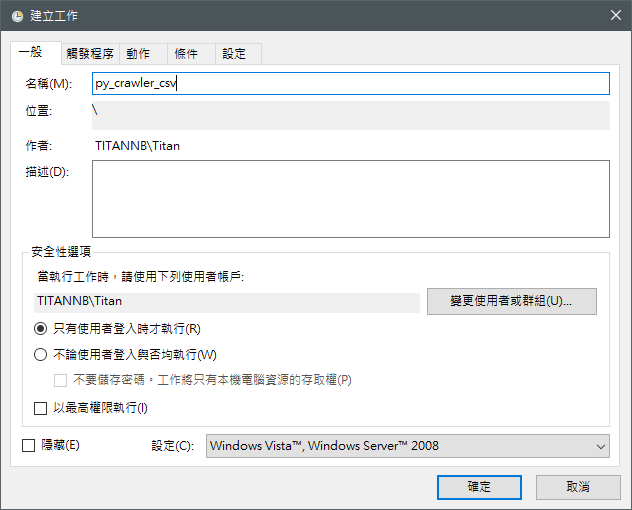

接著新增「觸發程序」

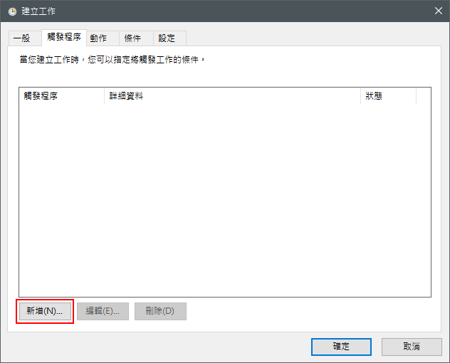

設定工作的開始時間，並選擇「僅一次」，以及設定工作要每隔多久就執行一次，並且要持續多久時間

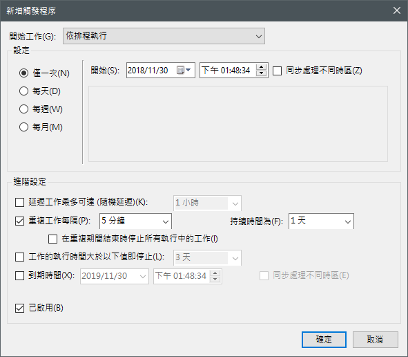

然後新增「動作」

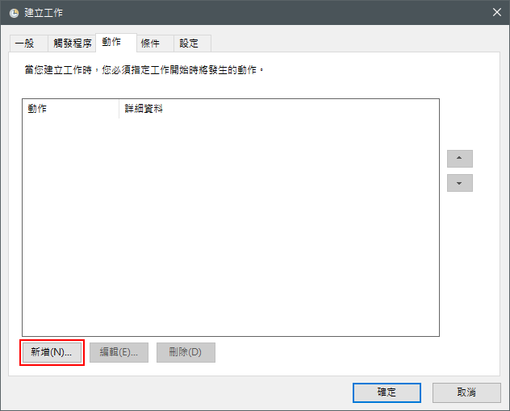

設定要自動執行的程式，這邊選擇的就是剛剛提到的 [批次檔](#Python-爬蟲程式的批次檔) ([原始碼](https://github.com/titangene/cwb-opendata-crawler-demo/blob/master/crawler.bat))

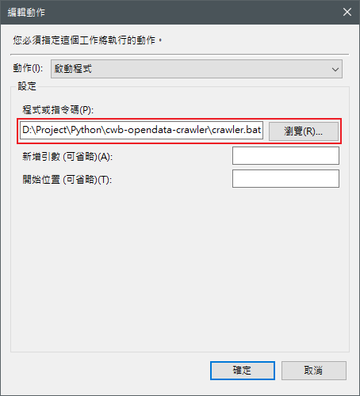

如果設定好了就可以按確定完成建立工作，此時就會看到在「工作排程器程式庫」內的工作清單中，多了剛剛新增的工作

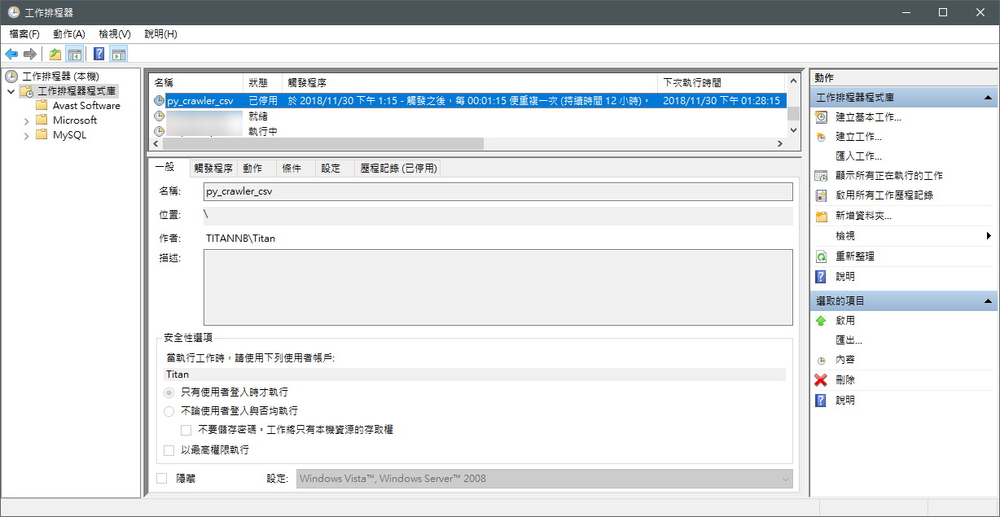

## 成果
可以看到爬蟲程式會在定期自動執行，執行的時候會跳出一個 `cmd` 視窗。若剛剛提到的 [批次檔](#Python-爬蟲程式的批次檔) 內沒有將 `REM pause` 這行註解，就會看到爬蟲程式執行完成後，不會自動關閉 `cmd` 視窗，這是為了可以立即看到該次爬蟲執行過程中輸出的訊息。

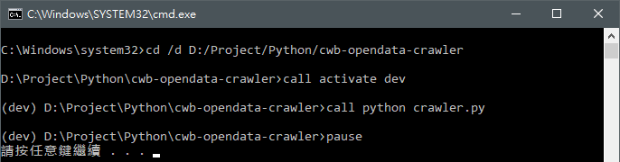

下圖就是自動執行爬蟲所抓到的資料：

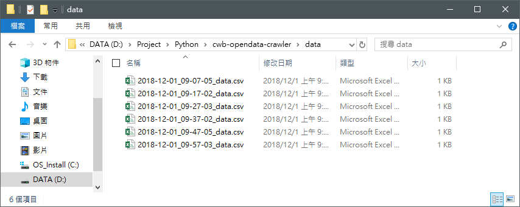

> 完整 source code：[titangene/cwb-opendata-crawler-demo](https://github.com/titangene/cwb-opendata-crawler-demo)