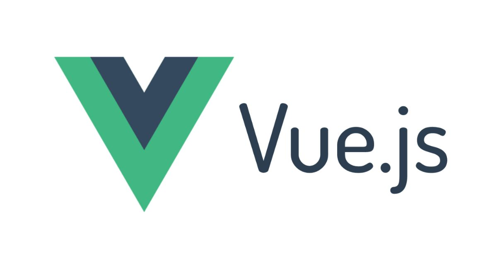
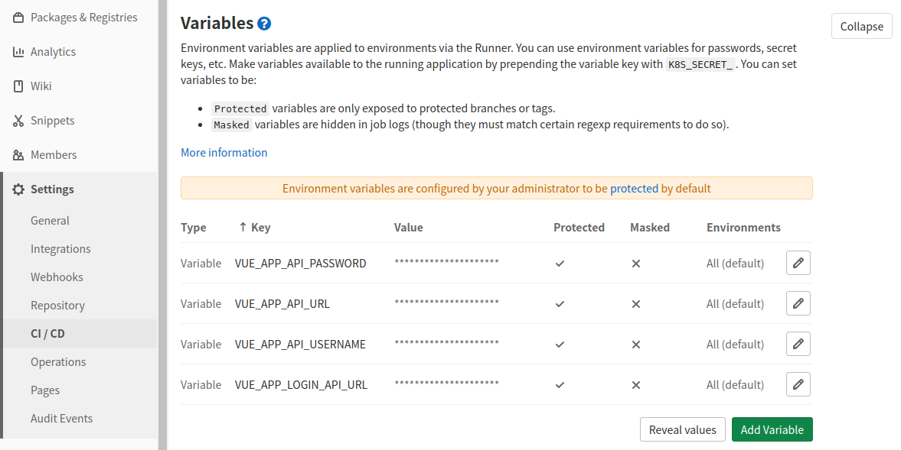
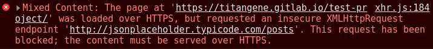

手動將 Vue CLI build 出來，然後再 push 至遠端部署，這些步驟雖然很簡單，但這樣不是很有效率，所以應透過自動部署來處理。本篇介紹如何透過 GitLab CI/CD 來將 Vue CLI 專案自動部署至 GitLab Page。

<!-- more -->

# CI/CD 自動部署設定

下面是參考 [Vue CLI 文件](https://cli.vuejs.org/zh/guide/deployment.html#github-pages) 提供的 GitLab Pages 自動部署的設定：

```javascript
// vue.config.js
module.exports = {
  publicPath: process.env.NODE_ENV === 'production' ? '/test-project/' : '/',
};
```

```yaml
# .gitlab-ci.yml
pages: # 必須定義一個名為 pages 的 job
  image: node:latest
  stage: deploy
  script:
    - yarn install --frozen-lockfile
    - yarn build
    - mv public public-vue # GitLab Pages 的鉤子設定在 public 檔案夾
    - mv dist public # 重命名 dist 檔案夾 (npm run build 之後的輸出位置)
  artifacts:
    paths:
      - public # artifact path 一定要在 /public , 這樣 GitLab Pages 才能獲取
  only:
    - master
```

> GitLab CI/CD 設定詳情可參閱：
> - [GitLab CI/CD pipeline configuration reference | GitLab](https://docs.gitlab.com/ee/ci/yaml/README.html)
> - [Exploring GitLab Pages | GitLab](https://docs.gitlab.com/ee/user/project/pages/introduction.html#gitlab-ciyml-for-a-repository-where-theres-also-actual-code)

原本 Vue CLI 文件提供的是 npm 的設定：

```yaml
pages: # 必須定義一個名為 pages 的 job
  image: node:latest
  stage: deploy
  script:
    - npm ci
    - npm run build
    - mv public public-vue # GitLab Pages 的鉤子設定在 public 檔案夾
    - mv dist public # 重命名 dist 檔案夾 (npm run build 之後的輸出位置)
  artifacts:
    paths:
      - public # artifact path 一定要在 /public , 這樣 GitLab Pages 才能獲取
  only:
    - master
```

# 設定 GitLab CI/CD 環境變數

在「Settings > CI/CD > Variables」頁面設定 CI/CD 要使用的環境變數：



> 註：因專案有用到 `.env` 檔，但我使用的是 `.env.local`，未將環境設定檔 push 至 GitLab，所以需要在 GitLab Repo 設定 CI/CD 要使用的環境變數，若你有 push `.env.production` 至 GitLab 就能視情況跳過此步驟。

# 開始自動部署

看到紅色框處的圖案就代表 CI/CD 正在自動部署中：


點擊進去後，點擊 Deploy 的 pages 可以查看部署進度：


等待一下...看到「Job succesed」就代表部署成功了！


# 設定 GitLab Page 發佈權限

到「Settings > Pages」頁面會看到下圖的橘色提醒，會出現這個提醒是因為你的專案是 private，所以預設 GitLab Page 也會是 private 的。

若想讓專案保持 private，但 GitLab Page 卻要 public，那就依照橘色提醒的步驟來做：


到「Settings > General > Visibility」頁面點擊「Expand」展開設定：


將 Pages 的設定改為「Everyone」：


再回到「Settings > Pages」頁面時，橘色提醒就會消失囉！接著就能進入部署好的 GitLab Page 看看是否成功！


# HTTPS：Mixed Content

開啟頁面後，會在 DevTools 的 console 看到下圖的錯誤訊息，這代表你目前開的 GitLab Page 是 HTTPS 的 URL，但你的網站的內容中有夾雜 HTTP 的資源，所以才會有此錯誤。

像下圖的範例是有些 API 是 HTTP 的，所以才會出現「Mixed Content」的錯誤：



```yaml
Mixed Content: The page at 'https://titangene.gitlab.io/test-project/' was loaded over HTTPS, but requested an insecure XMLHttpRequest endpoint 'http://xxx.com/api/posts'. This request has been blocked; the content must be served over HTTPS.
```

要解決此問題的方法就是不要用 HTTPS。

所以請至「Settings > Pages」頁面將「Force HTTPS」的設定取消打勾，這樣 GitLab Page 就不強制使用 HTTPS 了 (即預設會將 HTTP 自動重導向成 HTTPS)，設定後就能用 HTTP 查看頁面了！

