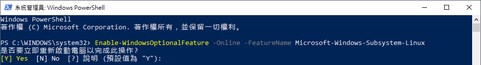
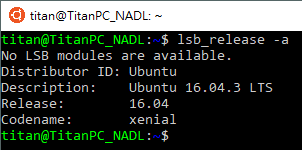
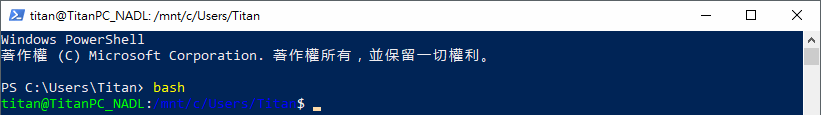

Windows Subsystem for Linux (簡稱 WSL)，由 Microsoft 與 Canonical 公司合作開發，可直接在 Windows 10 中建立一個 Linux 子系統，原生執行 Linux，還可自行選擇你想安裝的 Linux 發行版，例如：Ubuntu、Kali Linux、SUSE。

<!-- more -->

## 啟用 Windows Subsystem for Linux

使用系統管理者權限開啟 PowerShell，並執行下面命令啟用 `Windows Subsystem for Linux` 功能：

```shell
$ Enable-WindowsOptionalFeature -Online -FeatureName Microsoft-Windows-Subsystem-Linux
```

如果顯示下面訊息就代表你沒有使用系統管理員開啟 PowerShell：

```shell
Enable-WindowsOptionalFeature : 要求的作業需要提升的權限。
位於 線路:1 字元:1
+ Enable-WindowsOptionalFeature -Online -FeatureName Microsoft-Windows- ...
+ ~~~~~~~~~~~~~~~~~~~~~~~~~~~~~~~~~~~~~~~~~~~~~~~~~~~~~~~~~~~~~~~~~~~~~
    + CategoryInfo          : NotSpecified: (:) [Enable-WindowsOptionalFeature], COMException
    + FullyQualifiedErrorId : Microsoft.Dism.Commands.EnableWindowsOptionalFeatureCommand
```


接著等他跑一下...：


接著他會問是否要重啟電腦，因為預設是 Yes，所以可以直接按 `Enter`：



其實上面指令就等於去「控制台 > 程式集 > 開啟或關閉 Windows 功能」開啟「適用於 Linux 的 Windows 子系統」。


## 安裝 Linux 發行版

系統組建 (build) 必須要 Windows build 16215 或更新版本。若要想知道系統組建，可至 Windows 的「設定」內的「關於」即可查看。


你可以選擇你想安裝的 Linux 發行版：

- [Ubuntu 16.04 LTS](https://www.microsoft.com/zh-tw/p/ubuntu-1604-lts/9pjn388hp8c9)
- [Ubuntu 18.04 LTS](https://www.microsoft.com/zh-tw/p/ubuntu-1804-lts/9n9tngvndl3q)
- [Debian GNU/Linux](https://www.microsoft.com/zh-tw/p/debian-gnu-linux/9msvkqc78pk6)
- [OpenSUSE Leap 42](https://www.microsoft.com/zh-tw/p/opensuse-leap-42/9njvjts82tjx)
- [SUSE Linux Enterprise Server 12](https://www.microsoft.com/zh-tw/p/suse-linux-enterprise-server-12/9p32mwbh6cns)
- [Kali Linux](https://blogs.msdn.microsoft.com/commandline/2018/03/05/kali-linux-for-wsl/)


如果在安裝後直接開啟 Ubuntu，就會顯示 `Error: 0x8007007e` 錯誤就代表你沒有啟用 `Windows Subsystem for Linux` 功能，詳情請參考上面：

```shell
The WSL optional component is not enabled. Please enable it and try again.
See https://aka.ms/wslinstall for details.
Error: 0x8007007e
Press any key to continue...
```

安裝後啟動 Linux 發行版，此時會開啟一個 console 視窗。因為是第一次開啟，所以會先安裝 WSL，等它安裝完後，就會看到下面畫面，系統要你建立一個新的 Unix 使用者名稱：

```shell
Installing, this may take a few minutes...
Installation successful!
Please create a default UNIX user account. The username does not need to match your Windows username.
For more information visit: https://aka.ms/wslusers
Enter new UNIX username:
```


接著是設定此使用者的密碼，這邊的使用者與你的 Windows 使用者名稱和密碼沒有任何關係。詳情可參考官方的 [Linux User Account and Permissions | Microsoft Docs](https://docs.microsoft.com/zh-tw/windows/wsl/user-support) 文件。

如果顯示 `$` 就代表設定完成囉！


執行 `lsb_release -a` 指令就會看到 Linux 的系統版本：



## 在其他終端使用 Bash

如果在使用 CMD 、 PowerShell 或其他終端 (例如我常用的 Cmder) 時想用 bash shell，可使用 `bash` 指令就可以啟動新的 Ubuntu shell：

```shell
$ bash
```





## 存取目錄

如果想存取 `D:\project`，在此環境下的路徑就是 `/mnt/d/project`。


## 小結

如果有在跨平台開發或維運的朋友，這個功能應該是一直以來的願望吧？讓你在 Windows 上可以直接處理事情，不用再多開 VM 來使用，不只省資源，也省硬碟空間，重點是不用等 VM 開機...

## 參考連結

- [Install the Linux Subsystem on Windows 10 | Microsoft Docs](https://docs.microsoft.com/zh-tw/windows/wsl/install-win10)
- [【WSL】Windows Subsystem for Linux 安裝及基本配置！ | 台灣微軟學生大使](https://blogs.msdn.microsoft.com/microsoft_student_partners_in_taiwan/2017/10/03/wsltune/)
- [Bash on Ubuntu on Windows 的簡單使用 | Heresy's Space](https://kheresy.wordpress.com/2016/04/12/bash-on-ubuntu-on-windows/)
